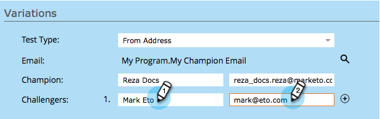

# Champion/Challenger: Van adres {#champion-challenger-from-address}

Wilt u een andere versie proberen dan Adres zonder problemen? Zo gaat het.

>[!PREREQUISITES]
>
>[ voeg een Kampioen E-mail/Challenger ](/help/marketo/product-docs/email-marketing/general/functions-in-the-editor/email-tests-champion-challenger/add-an-email-champion-challenger.md) toe

1. Selecteer **[!UICONTROL From Address]** in de vervolgkeuzelijst **[!UICONTROL Test Type]** in de testeditor voor e-mail.

   

   >[!NOTE]
   >
   >Het eerste Van Adres wordt aangewezen als **[!UICONTROL Champion]**. Volgende adressen worden **[!UICONTROL Challengers]** genoemd.

1. Ga **van Naam** (verlaten) in en **van Adres** (juist) voor de uitdagers.

   

   >[!TIP]
   >
   >Als u meer dan één ondervrager wilt, klikt u op het plusteken en voert u een andere naam en e-mail in.

1. Sleep de schuifregelaar om het percentage te bepalen dat moet worden verdeeld tussen mensen die e-mails ontvangen met de kampioen Van adres en personen die e-mails ontvangen met de uitdager Van adres(sen).

   

   >[!NOTE]
   >
   >**Voorbeeld**
   >
   >In de hierboven getoonde distributie, krijgt 15% van het totale publiek dat in de Slimme Lijst wordt gespecificeerd één van de e-mails met een bezoeker van Adres en 85% ontvangt de e-mail met de kampioen van Adres. E-mails voor meerdere challenger Van adressen hebben dezelfde waarde als 15%. Wanneer de test voorbij is, kunt u een winnaar handmatig declareren. Vanaf dat moment krijgen alle toekomstige mensen de beter presterende inhoud. Bij triggercampagnes kan het gerealiseerde percentage afwijken van het percentage dat u selecteert, omdat de verdeling mogelijk niet precies overeenkomt met de gekozen percentages. Dit kan gebeuren wanneer één variant een significant aantal niet-geabonneerde personen verwerkt, of wanneer één variant een operationele e-mail is terwijl de andere niet.

   Om statistisch vertrouwen te winnen, zeker bent u een percentage kiest dat genoeg mensen omvat dat uw test geldig is. Wees niet misleid door onovertuigende resultaten.

1. Klik op **[!UICONTROL Next]**.

   

   Voortgang! Laten we het blijven doen.

   >[!MORELIKETHIS]
   >
   >[ Champion/Challenger: Bepaal Champion Criteria ](/help/marketo/product-docs/email-marketing/general/functions-in-the-editor/email-tests-champion-challenger/champion-challenger-define-champion-criteria.md)
