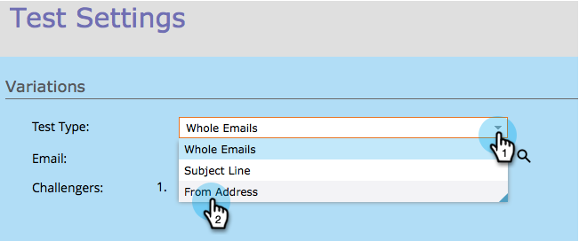

# Champion/Challenger: Van adres {#champion-challenger-from-address}

Wilt u een andere versie proberen dan Adres zonder problemen? Zo gaat het.

>[!NOTE]
>
>**Vereisten**
>
>* [Een e-mailkampioen/challenger toevoegen](add-an-email-champion-challenger.md)

>

1. In de e-mailtestredacteur, uitgezochte **Van Adres** in **Test Type **drop-down.

   

   >[!NOTE]
   >
   >Het eerste Van Adres wordt aangewezen als **Champion**. Volgende van adressen worden genoemd **Challengers**.

1. Typ de naam Van (links) en Van adres**** (rechts) voor de technici.

   

   >[!TIP]
   >
   >Als u meer dan één ondervrager wilt, klikt u op het plusteken en voert u een andere naam en e-mail in.

1. Sleep de schuifregelaar om het percentage te bepalen dat moet worden verdeeld tussen mensen die e-mails ontvangen met de kampioen Van adres en personen die e-mails ontvangen met de uitdager Van adres(sen).

   

   >[!NOTE]
   >
   >**Voorbeeld**
   >
   >
   >In de hierboven getoonde distributie, krijgt 15% van het totale publiek in de slimme lijst één van de e-mails met een bezoeker van Adres en 85% ontvangt de e-mail met de kampioen van Adres. E-mails voor meerdere challenger Van adressen hebben dezelfde waarde als 15%. Wanneer de test voorbij is, kunt u een winnaar handmatig declareren. Vanaf dat moment krijgen alle toekomstige mensen de beter presterende inhoud.

   Om statistisch vertrouwen te winnen, zeker bent u een percentage kiest dat genoeg mensen omvat dat uw test geldig is. Wees niet misleid door onovertuigende resultaten.  [Meer informatie dan je ooit wilde over statistisch vertrouwen](http://en.wikipedia.org/wiki/Confidence_interval).

1. Klik op **Volgende**.

   

   Voortgang! Laten we het blijven doen.

   >[!NOTE]
   >
   >**Verwante artikelen**
   >
   >    
   >    
   >    * [Champion/Challenger: Champion-criteria definiëren](champion-challenger-define-champion-criteria.md)

