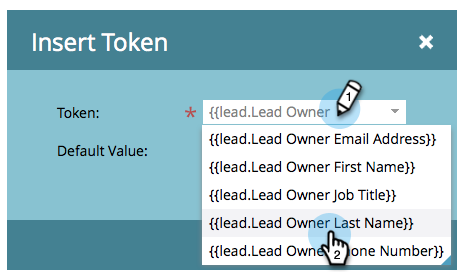

# E-mails verzenden van de eigenaar van de lead {#send-emails-from-the-lead-owner}

Wat als u een e-mail naar een lead namens de Lead Owner wilt sturen?  Zo gaat het.

1. Zoek uw e-mail, selecteer het en klik **geef Ontwerp** uit.

   

1. Klik op het veld **Van** (verwijder een bestaande naam) en klik op de knop **Token invoegen**.

   

1. Typ &quot;`{{lead.Lead Owner`&quot; en selecteer het token **`{{lead.Lead Owner First Name}}`**.

   

1. Voer een standaardwaarde in als de lead nog geen eigenaar van de lead heeft en klik op **Invoegen**.

   

1. Klik na het eerste teken, voeg een ruimte toe, dan klik **Symbolisch** knoop van het Tussenvoegsel.

   

1. Typ &quot;`{{lead.Lead Owner`&quot; en selecteer het token **`{{lead.Lead Owner Last Name}}`**.

   

1. Voer een standaardwaarde in als de lead nog geen eigenaar van de lead heeft en klik op **Invoegen**.

   

   >[!TIP]
   >
   >Zorg ervoor dat u ruimte hebt toegevoegd tussen de tokens voor de voornaam en achternaam.

1. Klik in het veld Van e-mail (verwijder een bestaand e-mailadres) en klik op de knop Token invoegen.

   

1. Typ &quot;`{{lead.Lead Owner`&quot; en selecteer het token **`{{lead.Lead Owner Email Address}}`**.

   

1. Voer een standaardwaarde in als de lead nog geen eigenaar van de lead heeft en klik op **Invoegen**.

   

1. Zorg ervoor **Reageren-aan** en **Onderwerp** gebieden bevolkt zijn, en u wordt gedaan!

   
