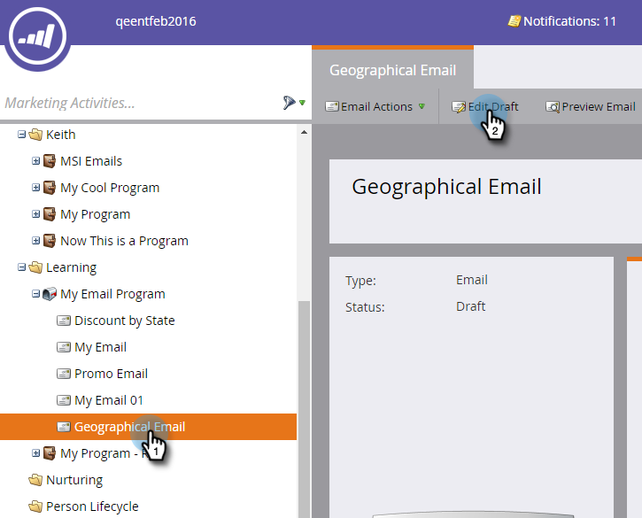

# Dynamische inhoud gebruiken in een e-mail {#using-dynamic-content-in-an-email}

>[!PREREQUISITES]
>
>[&#x200B; creeer een Segmentatie &#x200B;](/help/marketo/product-docs/personalization/segmentation-and-snippets/segmentation/create-a-segmentation.md)

Gebruik Dynamische inhoud in e-mails om de beoogde gegevens voor leads te verzenden.

>[!NOTE]
>
>Het gebruik van variabelen in dynamische inhoud in een e-mailbericht wordt alleen ondersteund bij het gebruik van triggercampagnes. Het wordt **niet** gesteund wanneer het gebruiken van de Campagnes van de Partij.

## Segmentering toevoegen {#add-segmentation}

1. Ga naar **[!UICONTROL Marketing Activities]** .

   

1. Selecteer uw e-mail en klik op **[!UICONTROL Edit Draft]** .

   

1. In dit voorbeeld maken we de onderwerpregel dynamisch. Klik op het [!UICONTROL Subject] gebied, dan klik de **Dynamische** knoop van het Merk.

   

   >[!NOTE]
   >
   >U kunt een element binnen e-mail ook dynamisch maken. Om dit te doen, selecteer het gebied, klik het tandwielpictogram, en selecteer **Dynamisch maken** (of [&#x200B; vervangen met Fragment &#x200B;](/help/marketo/product-docs/personalization/segmentation-and-snippets/snippets/create-a-snippet.md), afhankelijk van wat u doet).

1. Voer de naam van de segmentatie in, selecteer deze en klik op **[!UICONTROL Save]** .

   

   De segmentatie en de bijbehorende segmenten worden weergegeven onder het tabblad [!UICONTROL Dynamic] aan de rechterkant.

   

## Dynamische inhoud toepassen {#apply-dynamic-content}

>[!CAUTION]
>
>Het aantal dynamische inhoudselementen dat is toegestaan, is niet onbeperkt. Hoewel er geen specifieke getallimiet is (kan deze variëren op basis van de combinatie van inhoud), kan het te veel gebruiken van dynamische inhoud negatieve gevolgen hebben voor de prestaties van de e-mail. We raden u aan om de hoeveelheid dynamische inhoudselementen te behouden die wordt gebruikt tot minder dan 20 per e-mail.

1. Klik op de segmenten en voeg de onderwerpregel toe.

1. Herhaal dit voor elk segment.

   

>[!TIP]
>
>Maak een standaard-e-mailbericht voordat u inhoud toepast op de verschillende segmenten.

>[!CAUTION]
>
>Wijzigingen in het inhoudsblok Standaardsegment worden toegepast op alle segmenten.

Zoet! Nu kunt u flexibele e-mails naar uw doelgroep sturen.

>[!MORELIKETHIS]
>
>* [&#x200B; Voorproef e-mail met Dynamische Inhoud &#x200B;](/help/marketo/product-docs/email-marketing/general/functions-in-the-editor/preview-an-email-with-dynamic-content.md)
>* [&#x200B; Dynamische Inhoud van het Gebruik in een het landen Pagina &#x200B;](/help/marketo/product-docs/demand-generation/landing-pages/free-form-landing-pages/use-dynamic-content-in-a-free-form-landing-page.md)
