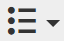

# De Rich Text Editor gebruiken {#using-the-rich-text-editor}

De Rich Text Editor (RTE) wordt in Marketo weergegeven en is beschikbaar wanneer u inhoud wilt toevoegen of bewerken. Er wordt een versie van deze versie weergegeven op bestemmingspagina&#39;s, programma&#39;s, e-mails, formulieren en fragmenten. Klik gewoon op Concept **** bewerken en deze verschijnt dan ten dienste van u.

## Editor-instellingen {#editor-settings}

De instelling van het basisblokelement definieert welke tags de inhoud omlopen. Standaard gebruikt het element voor het basisblok van de e-mail 
 -tags. U kunt dit wijzigen door de onderstaande stappen te volgen.

>[!TIP]
>
>Terwijl u de optie hebt om uw basisblokelement te kiezen, adviseren wij altijd gebruikend standaardmontages voor de beste gebruikerservaring.

1. Klik op **Beheerder**.

   

1. Klik op **E-mail**.

   

1. Klik op Instellingen **van teksteditor** bewerken.

   

1. Selecteer in het vervolgkeuzemenu **E-mail / Fragmenteditor** de optie 
 of Geen en klik op **Opslaan**. 
 wordt gebruikt in dit voorbeeld.

   

   Als u 

 in een E-mailsjabloon ziet u het volgende gedrag HTML-bron wanneer u de sectie opent en &quot;Tekst gaat hier&quot; in de editor typt:

<table> 
 <tbody> 
  <tr> 
   <th>&lt;p&gt;</th> 
   <th>&lt;div&gt;</th> 
   <th>Geen</th> 
  </tr> 
  <tr> 
   <td>
&lt;div class="mktEditable"&gt; &lt;p&gt;Hier komt tekst&lt;/p&gt; &lt;/div&gt;
</td> 
   <td>
&lt;div class="mktEditable"&gt; &lt;div&gt;Tekst komt hier&lt;/div&gt; &lt;/div&gt;
</td> 
   <td>
&lt;div class="mktEditable"&gt; Tekst komt hier &lt;/div&gt;
</td> 
  </tr> 
 </tbody> 
</table>

>[!TIP]
>
>U kunt ook het basisblokelement van de Landing Page Editor wijzigen door dezelfde stappen uit te voeren, maar door in Stap 4 op de vervolgkeuzelijst **Landing Page Editor** te klikken in plaats van in de Editor e-mail/Fragment.

>[!NOTE]
>
>Het basisblokelement is altijd 
 voor RTF-tokens.

## Functies {#features}

Hier zijn de eigenschappen u in RTE zult vinden.

| Pictogram | Naam | Wat het doet |
|---|---|---|
|  | Lettertypefamilie | Kies uw stijl—We hebben genoeg! |
|  | Tekengrootte | Hoe groot wil je het? 25 keuzen, van 8 px tot 90 px. |
|  | Stijlen | Kies Alinea of zes stijlen voor kop (voor bestemmingspagina&#39;s). |
|  | Regelafstand | Kies de afstand tussen de lijnen. |
|  | Tekstkleur | Zwart, rood of wat je maar wilt. |
|  | Achtergrondkleur | Benadruk voor nadruk. |
|  | Vet | **Donkerder en dikker**. |
|  | Cursief | *Hoekig, voor accenten of* noteringen. |
|  | Onderstrepen | Hiermee plaatst u een lijn onder de tekst. |
|  | Uitlijning | Gebruik deze vervolgkeuzelijst om uw tekst en afbeeldingen op te maken. Centreer de randen, kies links of rechts uitlijnen of spreid de rand naar rand met volledige uitvulling. |  |  | Lijst | Kies opsommingstekens of nummers in het vervolgkeuzemenu. Opsommingstekens zijn geschikt voor lijsten en nummers met stappen. |
|  | Inspringen | Kies meer of minder inspringing. Gebruik deze optie voor alinea&#39;s of tekst die u wilt uitspringen. |
|  | Koppeling invoegen/bewerken | Een koppeling naar een website of andere inhoud plaatsen; u kunt er gemakkelijk wijzigingen in aanbrengen. |
|  | Afbeelding invoegen/bewerken | Een foto is duizend woorden waard. Zet er een neer. Klik op het camerapictogram om door uw Design Studio te bladeren. U kunt afbeeldingen naast elkaar neerzetten. |
|  | Token invoegen | Een krachtig hulpmiddel, ideaal voor het aanpassen van e-mail en het bijhouden van gegevens. Voer een standaardwaarde in. |
|  | Ongedaan maken | Oeps! Laten we een stap terugzetten en het opnieuw proberen. |
|  | Opnieuw | Als het echt oké is zoals het is, ga terug naar het origineel. |
|  | Tabel | Bouw je eigen, zoals deze. Met een vervolgkeuzemenu kunt u de toepassing configureren. |
|  | Anker invoegen | Anker neerzetten! |
|  | Horizontale lijn | Veel toepassingen - Ideaal voor scheidingsgedeelten. |
|  | HTML bewerken | Hiermee wordt de HTML-broneditor weergegeven, zodat u de code kunt afstemmen. |
|  | Subscript | Lage hangende letters (zoals in O`2`). |
|  | Superscript | U hebt de macht! (2`6`). |
|  | Doorhalen | `<s>Put a line through text, like this</s>`. |
|  | Speciaal teken | Wil je over euro&#39;s praten? Mathematisch? Je hebt 243 keuzen. |
|  | Zoeken en vervangen | U kunt veel sneller naar dingen zoeken en deze wijzigen dan elke instantie zelf. |
|  | Opmaak wissen | Terugkeren naar standaard. |
|  | Annuleren | Druk op de knop om te zeggen: &quot;Het geeft niet.&quot; |
|  | Opslaan | Druk op de knop om te zeggen: &quot;OK, ik vind het leuk.&quot; |

>[!TIP]
>
>U bewerkt de HTML en de tekst op afzonderlijke schermen. Klik op **Kopiëren vanuit HTML** op het tabblad **Tekst** en **** sla de tekst op zodat deze overeenkomt met de HTML.

>[!NOTE]
>
>U bent niet beperkt tot de lettertypen in de vervolgkeuzelijst. U kunt een object gebruiken dat niet wordt vermeld, door de HTML-code te openen. Alle weblettertypen worden ondersteund in Marketo, maar weblettertypen werken niet overal in e-mailclients.

## Openingspagina&#39;s {#landing-pages}

De instelling van het basisblokelement definieert welke tags de inhoud omlopen. Standaard gebruikt het basisblokelement van de landingspagina 
 -tags. U kunt dit wijzigen door de onderstaande stappen te volgen.

>[!TIP]
>
>Terwijl u de optie hebt om uw basisblokelement te kiezen, adviseren wij altijd gebruikend standaardmontages voor de beste gebruikerservaring.

1. Klik op **Beheerder**.

   

1. Klik op **E-mail**.

   

1. Klik op Instellingen **van teksteditor** bewerken.

   

1. Selecteer in het vervolgkeuzemenu **Landing Page Editor** de optie 
 of Geen en klik op **Opslaan**. 
 wordt gebruikt in dit voorbeeld.

   

   En dat is het!

