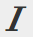

# De Rich Text Editor gebruiken {#using-the-rich-text-editor}

De Rich Text Editor (RTE) wordt in Marketo weergegeven en is beschikbaar wanneer u inhoud wilt toevoegen of bewerken. Er wordt een versie van deze versie weergegeven op bestemmingspagina&#39;s, programma&#39;s, e-mails, formulieren en fragmenten. Klik gewoon op **[!UICONTROL Edit Draft]** en het verschijnt om u te dienen.

## Editor-instellingen {#editor-settings}

De instelling van het basisblokelement definieert welke tags de inhoud omlopen. Standaard gebruikt het element voor het basisblok van de e-mail `
` -tags. U kunt dit wijzigen door de onderstaande stappen te volgen.

>[!TIP]
>
>Terwijl u de optie hebt om uw basisblokelement te kiezen, adviseren wij altijd gebruikend standaardmontages voor de beste gebruikerservaring.

1. Klik op **[!UICONTROL Admin]**.

   

1. Klik op **[!UICONTROL Email]**.

   

1. Klik op **[!UICONTROL Edit Text Editor Settings]**.

   

1. Selecteer **[!UICONTROL Email]of[!UICONTROL Snippet Editor]** in de vervolgkeuzelijst `
` / [!UICONTROL None] en klik op **[!UICONTROL Save]** . `
` wordt gebruikt in dit voorbeeld.

   

   Als u `

` in een E-mailsjabloon hebt, wordt het volgende HTML Source-gedrag weergegeven wanneer u de sectie opent en &quot;Tekst gaat hier&quot; in de editor typt:

<table>
 <tbody>
  <tr>
   <th>&lt;p&gt;</th>
   <th>&lt;div&gt;</th>
   <th>Geen</th>
  </tr>
  <tr>
   <td>
&lt;div class="mktEditable"&gt;  &lt;p&gt;Tekst gaat hier&lt;/p&gt; &lt;/div&gt;
</td>
   <td>
&lt;div class="mktEditable"&gt;  &lt;div&gt;Tekst gaat hier&lt;/div&gt;  &lt;/div&gt;
</td>
   <td>
&lt;div class="mktEditable"&gt;   Tekst gaat hier  &lt;/div&gt;
</td>
  </tr>
 </tbody>
</table>

>[!TIP]
>
>U kunt ook het basisblokelement van de Landing Page Editor wijzigen door dezelfde stappen uit te voeren, maar door in stap 4 op de vervolgkeuzelijst **[!UICONTROL Landing Page Editor]** te klikken in plaats van op [!UICONTROL Email] / [!UICONTROL Snippet Editor] .

>[!NOTE]
>
>Het basisblokelement is altijd `
` voor rijke-tekstprogrammeertokens.

## Functies {#features}

Hier zijn de eigenschappen u in RTE zult vinden.

| Pictogram | Naam | Wat doet het? |
|---|---|---|
|  | [!UICONTROL Font Family] | Kies uw stijl—We hebben genoeg! |
|  | [!UICONTROL Font Size] | Hoe groot wil je het? 25 keuzen, van 8 px tot 90 px. |
|  | [!UICONTROL Styles] | Kies Alinea of zes stijlen voor kop (voor bestemmingspagina&#39;s). |
|  | [!UICONTROL Line Spacing] | Kies de afstand tussen de lijnen. |
|  | [!UICONTROL Text Color] | Zwart, rood of wat je maar wilt. |
|  | [!UICONTROL Background Color] | Benadruk voor nadruk. |
|  | [!UICONTROL Bold] | **Donkerder en dikker**. |
|  | [!UICONTROL Italic] | *Angled, voor nadruk of citatie* s. |
|  | [!UICONTROL Underline] | Hiermee plaatst u een lijn onder de tekst. |
|  | [!UICONTROL Alignment] | Gebruik deze vervolgkeuzelijst om uw tekst en afbeeldingen op te maken. Centreer de randen, kies links of rechts uitlijnen of spreid de rand naar rand met volledige uitvulling. |  |  | Lijst | Kies opsommingstekens of nummers in het vervolgkeuzemenu. Opsommingstekens zijn geschikt voor lijsten en nummers met stappen. |
|  | [!UICONTROL Indent] | Kies meer of minder inspringing. Gebruik deze optie voor alinea&#39;s of tekst die u wilt uitspringen. |
|  | [!UICONTROL Insert/Edit Link] | Plaats een koppeling naar een website of andere inhoud en breng gemakkelijk wijzigingen aan. |
|  | [!UICONTROL Insert/Edit Image] | Een foto is duizend woorden waard. Zet er een neer. Klik op het camerapictogram om door uw Design Studio te bladeren. U kunt afbeeldingen naast elkaar neerzetten. |
|  | [!UICONTROL Insert Token] | Een krachtig hulpmiddel, ideaal voor het aanpassen van e-mail en het bijhouden van gegevens. Voer een standaardwaarde in. |
|  | [!UICONTROL Undo] | Oeps! Laten we een stap terugzetten en het opnieuw proberen. |
|  | [!UICONTROL Redo] | Als het echt oké is zoals het is, ga terug naar het origineel. |
|  | [!UICONTROL Table] | Bouw je eigen, zoals deze. Met een vervolgkeuzemenu kunt u de toepassing configureren. |
|  | [!UICONTROL Insert Anchor] | Anker neerzetten! |
|  | [!UICONTROL Horizontal Line] | Veel toepassingen - Ideaal voor scheidingsgedeelten. |
|  | [!UICONTROL Edit HTML] | Hiermee opent u de HTML Source Editor zodat u de code kunt afstemmen. |
|  | [!UICONTROL Subscript] | Lage-hangende brieven (zoals in O `2`). |
|  | [!UICONTROL Superscript] | U hebt de macht! (2 `6`). |
|  | [!UICONTROL Strikethrough] | `<s>Put a line through text, like this</s>`. |
|  | [!UICONTROL Special Character] | Wil je het hebben over euro&#39;s? Mathematisch? Je hebt 243 keuzen. |
|  | [!UICONTROL Find and Replace] | U kunt veel sneller naar dingen zoeken en deze wijzigen dan elke instantie zelf. |
|  | [!UICONTROL Clear Formatting] | Terugkeren naar standaard. |
|  | [!UICONTROL Cancel] | Druk op de knop om te zeggen: &quot;Het geeft niet.&quot; |
|  | [!UICONTROL Save] | Druk op de knop om te zeggen: &quot;OK, ik vind het leuk.&quot; |

>[!TIP]
>
>U bewerkt de HTML en de tekst op afzonderlijke schermen. Klik eerst op **[!UICONTROL Copy from HTML]** op de tab **[!UICONTROL Text]** en vervolgens op **[!UICONTROL Save]** , zodat de tekst overeenkomt met de HTML.

>[!NOTE]
>
>U bent niet beperkt tot de lettertypen in de vervolgkeuzelijst. U kunt een object gebruiken dat niet wordt vermeld, door de HTML-code te openen. Alle weblettertypen worden ondersteund in Marketo, maar weblettertypen werken niet overal in e-mailclients.

## Landingspagina&#39;s {#landing-pages}

De instelling van het basisblokelement definieert welke tags de inhoud omlopen. Standaard gebruikt het basisblokelement van de landingspagina `
` -tags. U kunt dit wijzigen door de onderstaande stappen te volgen.

>[!TIP]
>
>Terwijl u de optie hebt om uw basisblokelement te kiezen, adviseren wij altijd gebruikend standaardmontages voor de beste gebruikerservaring.

1. Klik op **[!UICONTROL Admin]**.

   

1. Klik op **[!UICONTROL Email]**.

   

1. Klik op **[!UICONTROL Edit Text Editor Settings]**.

   

1. Selecteer **[!UICONTROL Landing Page Editor]** of `
` in de vervolgkeuzelijst [!UICONTROL None] en klik op **[!UICONTROL Save]** . `
` wordt gebruikt in dit voorbeeld.

   

   En dat is het!
