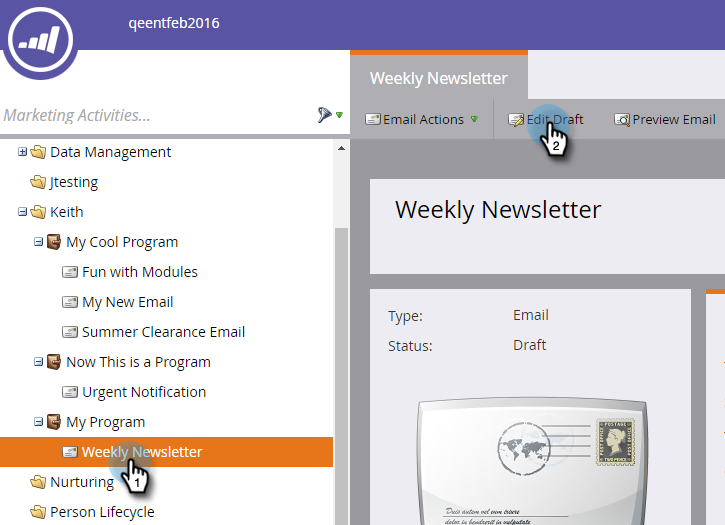

# Een e-mailscripttoken toevoegen aan uw e-mail {#add-an-email-script-token-to-your-email}

Nadat u [uw e-mailscript gemaakt](/help/marketo/product-docs/email-marketing/general/using-tokens/create-an-email-script-token.md), wilt u deze toevoegen aan een e-mail om deze in actie te zien. Zo gaat het.

>[!NOTE]
>
>De totale grootte van alle scripttokens die in één e-mail worden ingevoegd, mag niet groter zijn dan 100 kB.

1. Ga naar de **Marketingactiviteiten** gebied.

   

1. Zoek en selecteer de e-mail waaraan u het token wilt toevoegen en klik op **Concept bewerken**.

   

   >[!TIP]
   >
   >U kunt desgewenst ook het token toevoegen aan een e-mailsjabloon.

1. Dubbelklik op het bewerkbare gebied waaraan u het token wilt toevoegen.

   

1. Plaats de cursor op de gewenste positie voor het token en klik op het pictogram Token invoegen.

   

1. Zoek en selecteer de e-mailscripttoken die u eerder hebt gemaakt en klik op **Invoegen**.

   

   >[!TIP]
   >
   >Voeg desgewenst een standaardwaarde toe.

1. Klikken **Opslaan**.

   

>[!NOTE]
>
>Vergeet niet om [e-mail goedkeuren](/help/marketo/product-docs/email-marketing/general/creating-an-email/approve-an-email.md).

Dat is het! Wanneer deze e-mail wordt verzonden, wordt het script achter het token uitgevoerd en wordt de inhoud gevuld.
