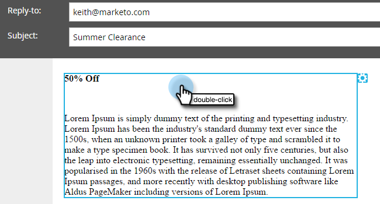

# Tokens toevoegen aan een e-mailkoppeling {#add-tokens-to-an-email-link}

Als u extra en persoonspecifieke parameters in uw koppelingen wilt invoegen, kunt u tokens gebruiken. Zo gaat het.

1. Selecteer uw e-mail en klik op het tabblad **[!UICONTROL Edit Draft]** .

   

1. Dubbelklik op een bewerkbaar gebied.

   

1. Zoek of schrijf de tekst voor de koppeling. Markeer het en klik op het pictogram **[!UICONTROL Insert/Edit Link]** .

   

1. Typ de gewenste token(s) in **[!UICONTROL URL]** en klik op **[!UICONTROL Insert]** .

   

1. Klik op **[!UICONTROL Save]**.

   

   En dat is het!

>[!MORELIKETHIS]
>
>[&#x200B; Gebruikend URLs in Mijn Tokens &#x200B;](/help/marketo/product-docs/email-marketing/general/using-tokens/using-urls-in-my-tokens.md)
