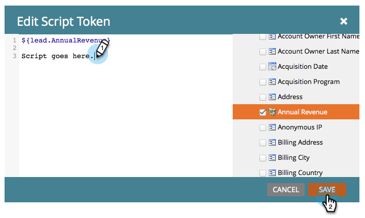

# Een e-mailscripttoken maken {#create-an-email-script-token}

Voor gevorderde ontwikkelaars, kunt u [manuscripten ](https://velocity.apache.org/engine/1.7/user-guide.html) in uw e-mail gebruiken. Zo doe je het.

1. Ga naar **Marketingactiviteiten**.

   

1. Zoek en selecteer een programma (Event, Default, of Engagement, enz.).

   

1. Onder **Mijn tokens** tabel, sleep in een **E-mailmanuscript** teken.

   

1. Noem uw e-mailmanuscriptteken en **klik om** zijn inhoud uit te geven.

   

1. Gebruik de boom op het recht om in **Person, Opportunity**, of **Aangepast Voorwerp** tokens te slepen.

   

   >[!NOTE]
   >
   >Wanneer u een array (opportunity of aangepast object) opent, beperkt u zich tot de meest recente 10 items die aan de persoon zijn gekoppeld.

1. Het token wordt ingeschakeld/actief nadat u het naar de scripteditor hebt gesleept.

   

   >[!NOTE]
   >
   >Als u tokens typt, moet u ervoor zorgen dat alle corresponderende tokens in de structuur worden gecontroleerd/geactiveerd. Als u dit niet doet, worden deze ook beschouwd als normale tekst en werken ze niet.

1. Schrijf uw script in Snelheid. Hier volgen enkele nuttige bronnen:

   * [Documenten met e-mailscripts voor Marketo Developers](https://developers.marketo.com/email-scripting/)
   * [Gebruikershandleiding voor snelheid](https://velocity.apache.org/engine/devel/user-guide.html)
   * [Snelheidsnaslaggids](https://velocity.apache.org/engine/devel/vtl-reference-guide.html)
   * [Velocity Tools Javadoc](https://velocity.apache.org/tools/releases/2.0/javadoc/index.html)

1. Zodra uw manuscript wordt voltooid, klik **sparen**.

   

1. Klik nog een keer op **Opslaan**.

   

Nu kunt u deze token gebruiken in uw e-mails. Het script wordt uitgevoerd telkens wanneer een e-mail wordt verzonden.

>[!MORELIKETHIS]
>
>[Een e-mailscripttoken toevoegen aan uw e-mail](/help/marketo/product-docs/email-marketing/general/using-tokens/add-an-email-script-token-to-your-email.md)
