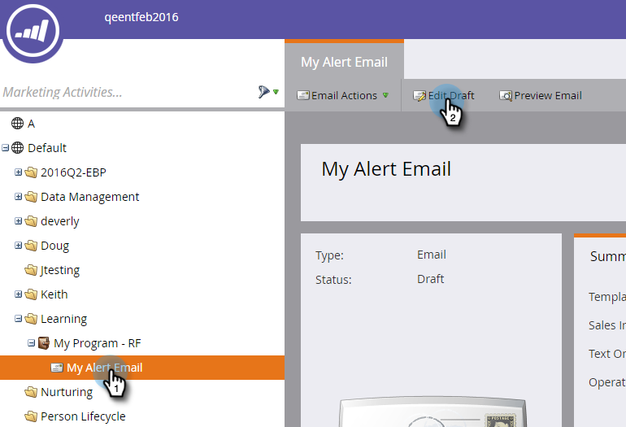

# Het token voor waarschuwinggegevens verzenden gebruiken {#use-the-send-alert-info-token-sp-send-alert-info}

De `{{SP_Send_Alert_Info}}` token is een speciaal token dat moet worden gebruikt bij het maken van e-mailberichten voor uw verkoopteam.

>[!TIP]
>
>Deze token werkt alleen zoals bedoeld wanneer de e-mail die deze token bevat, wordt verzonden met de [Waarschuwing verzenden](/help/marketo/product-docs/core-marketo-concepts/smart-campaigns/flow-actions/send-alert.md) stap Stroom. Het werkt niet als het wordt gebruikt in een stap E-mail verzenden.

Voorbeeld, waarschuwing:

>[!NOTE]
>
>Koppen omhoog! URL&#39;s in waarschuwingen hebben vervaldatums, zodat ze beschikken over een interface die deze berichttypen ondersteunt. Vervaldatums zijn [geconfigureerd door een beheerder](/help/marketo/product-docs/administration/settings/edit-link-expiration-in-reports-and-alerts.md).

De volgende informatie maakt deel uit van de `{{SP_Send_Alert_Info}}`:

* Voornaam en achternaam als koppeling naar de persoongegevens in Marketo
* Een koppeling naar de persoon in uw CRM
* De naam van de campagne in Marketo die de waarschuwing heeft verzonden
* Het tijdstip waarop de signalering is verzonden

>[!NOTE]
>
>De verbinding aan CRM zal slechts verschijnen als de persoon in het systeem van CRM (momenteel niet beschikbaar met Dynamica CRM) is. De koppeling is toegankelijk voor zowel Marketo- als niet-Marketo-gebruikers.

## Het token SP_Send_Alert_Info toevoegen aan een e-mail {#add-the-sp-send-alert-info-token-to-an-email}

1. Selecteer het e-mailbericht en klik op **Concept bewerken**.

   

1. Dubbelklik op het bewerkbare gebied waaraan u het token wilt toevoegen.

   

1. Plaats de cursor op de gewenste locatie voor het token en klik vervolgens op de knop **Token invoegen** knop.

   

1. Zoek en selecteer de **`{{SP_Send_Alert_Info}}`** token en klik op **Invoegen**.

   

1. Klikken **Opslaan**.

   

>[!NOTE]
>
>Vergeet niet uw e-mail goed te keuren.

Goed spul! Dit token is zeer nuttig en u moet het gebruiken in alle waarschuwingen die u voor uw verkoopteam maakt.
