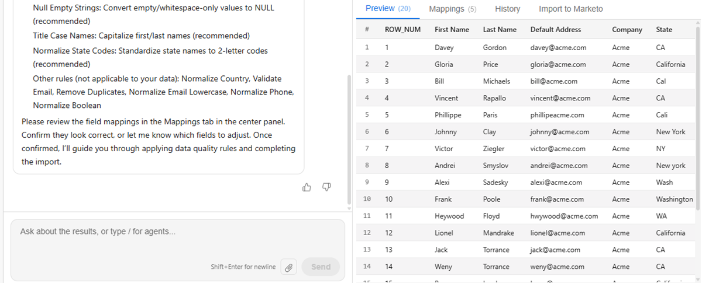
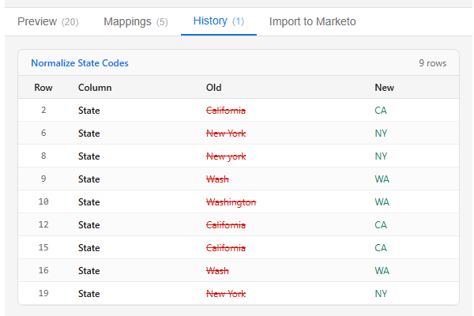

# Importleads {#import-leads}

U kunt lijsten met leads importeren en dedupliceren in uw Marketo Engage-database met ondersteuning voor veldtoewijzingen.

## Hoe wordt het gebruikt {#how-to-use}

1. In uw Mijn Marketo, klik **bouwen met AI** tegel.

   

1. Klik de **Invoer leidt** agent.

   

   Je wordt meegenomen naar de conversatie-AI. In de linkerruit, post de Agent begeleiding, reacties, en opties voor welke gegevensnormalisatie kenmerken om te lopen.

   

1. Als u uw leads wilt importeren, klikt u op het pictogram voor de bijlage en uploadt u deze via het CSV-bestand.

   

1. Het type _de lijst van de Invoer_ en klikt **verzendt**.

   

   Uw lijst wordt voorvertoond in de middenconsole.

   

1. Ga een gewenste bedrijfsregel in en klik **verzenden**.

   

   De resultaten worden weergegeven in de middenconsole.

   

   Voer desgewenst aanvullende bedrijfsregels in.

1. Om de in kaart gebrachte gebieden te bekijken, klik de **Toewijzingen** tabel.

1. Als een veld onjuist is toegewezen, repareert u deze hier.

   

1. Wanneer klaar om uw lijst in te voeren, klik de **Invoer in Marketo** tabel.

1. Selecteer de doelmap en voer een naam in. Controleer elke toestemmingsdoos en klik **goedkeuren &amp; de Invoer in Marketo**.

   

Wanneer het importeren is voltooid, wordt bij de verificatie een overzicht van verwerkte leads, mislukte rijen en eventuele waarschuwingen weergegeven.
