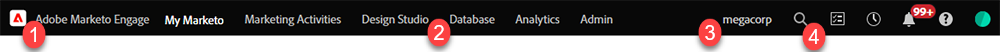

# Marketo Engage Modern UX - Overzicht {#overview}

Welkom bij de Adobe Marketo Engage Modern UX (gebruikerservaring), een bijgewerkte interface die verbeterde bruikbaarheid en een nieuwe look and feel biedt op het hele Marketo Engage-platform.

>[!PREREQUISITES]
>
>Als uw team van IT Webtoegang gebruikend een lijst van gewenste personen beperkt, vraag hen om de volgende domeinen (met inbegrip van de asterisk) toe te voegen om alle middelen en websockets van Marketo toe te staan:
>
>* *.marketo.com
>* *.marketodesigner.com
>* *.mktoweb.com

## Nieuwe functies {#whats-new}

Er is veel nieuwe functionaliteit in de Moderne UX, die allen wordt ontworpen om uw marketing ervaring beduidend te verbeteren.

**Pictogrammen**

De nieuwe interfaceeigenschappen verbeteren en breidden iconografie uit.

**Globale Navigatie**

Tot ziens superbal. Je hebt nu snel toegang tot alle belangrijkste Marketo Engage-secties.

**Instantie URL**

U hebt ook snel toegang tot uw insteekmodule-id, die nu wordt weergegeven in de URL van uw exemplaar (nog nuttiger voor gebruikers met meerdere abonnementen).

## Nieuwe structuuropties {#new-tree-options}

Er zijn veel nieuwe boomfuncties beschikbaar.

>[!NOTE]
>
>Als u een zoekopdracht uitvoert in de structuur, worden alleen de eerste 250 resultaten weergegeven. Als na een onderzoek u van uw activa niet kunt de plaats bepalen, te gebruiken gelieve de [ Globale functie van het Onderzoek ](/help/marketo/product-docs/marketo-engage-modern-ux/using-the-global-search.md).

**Klassieke Marketo vs. Nieuwe Marketo**

<table>
 <tbody>
  <tr>
   <th>Functie</th>
   <th>Klassiek</th>
   <th>Next-gen</th>
  </tr>
  <tr>
   <td>Meerdere filters tegelijk toepassen</td>
   <td></td>
   <td><strong>X</strong></td>
  </tr>
  <tr>
   <td>Knooppunt van concept- en goedkeuringsstructuur</td>
   <td></td>
   <td><strong>X</strong></td>
  </tr>
  <tr>
   <td>Lokale elementen maken in programmamappen</td>
   <td></td>
   <td><strong>X</strong></td>
  </tr>
  <tr>
   <td>Dubbelklikken om boomknooppunten uit of samen te vouwen</td>
   <td><strong>X</strong></td>
   <td><strong>X</strong></td>
  </tr>
  <tr>
   <td>Slepen en neerzetten van boom naar betrokkenheidsstroom</td>
   <td><strong>X</strong></td>
   <td></td>
  </tr>
  <tr>
   <td>Slepen en neerzetten in de boomstructuur</td>
   <td><strong>X</strong></td>
   <td><strong>X</strong></td>
  </tr>
  <tr>
   <td>Filteren op elementtype en statussen</td>
   <td><i>gedeeltelijk</i></td>
   <td><strong>X</strong></td>
  </tr>
  <tr>
   <td>Achtergrond markeren om hiërarchie in focusstatus weer te geven</td>
   <td></td>
   <td><strong>X</strong></td>
  </tr>
  <tr>
   <td>Trefwoorden markeren tijdens zoeken</td>
   <td></td>
   <td><strong>X</strong></td>
  </tr>
  <tr>
   <td>Horizontaal schuiven</td>
   <td><strong>X</strong></td>
   <td><strong>X</strong></td>
  </tr>
  <tr>
   <td>Status van aanwijzen van boomknooppunten</td>
   <td><strong>X</strong></td>
   <td><strong>X</strong></td>
  </tr>
  <tr>
   <td>Hele boomstructuur snel samenvouwen</td>
   <td></td>
   <td><strong>X</strong></td>
  </tr>
  <tr>
   <td>Snel samenvouwen tot hoofdknooppunt</td>
   <td></td>
   <td><strong>X</strong></td>
  </tr>
  <tr>
   <td>Real-time update</td>
   <td></td>
   <td><strong>X</strong></td>
  </tr>
  <tr>
   <td>Residuele boom</td>
   <td><strong>X</strong></td>
   <td><strong>X</strong></td>
  </tr>
  <tr>
   <td>Zoeken in gearchiveerde mappen</td>
   <td></td>
   <td><strong>X</strong></td>
  </tr>
  <tr>
   <td>Zoektekenreeks opgeslagen bij invoeren van algemene zoekopdracht in boomstructuurzoekopdracht</td>
   <td></td>
   <td><strong>X</strong></td>
  </tr>
  <tr>
   <td>Alle werkruimten in één boomstructuur tonen</td>
   <td><strong>X</strong></td>
   <td><strong>X</strong></td>
  </tr>
  <tr>
   <td>Statusbadge en knopinfo</td>
   <td></td>
   <td><strong>X</strong></td>
  </tr>
  <tr>
   <td>Zoeklogica 'Woord begint met'</td>
   <td></td>
   <td><strong>X</strong></td>
  </tr>
 </tbody>
</table>

## Global Nav {#global-nav}

Kijk eens naar de nieuwe Global Nav.

<table>
 <tbody>
  <tr>
   <td>1</td>
   <td>Geen superball drop-down meer</td>
  </tr>
  <tr>
   <td>2</td>
   <td>Alle vorige superbalkobjecten weergegeven</td>
  </tr>
  <tr>
  <tr>
   <td>3</td>
   <td>Als u meerdere abonnementen hebt, klikt u op de subnaam om gemakkelijk over te schakelen naar een andere naam</td>
  </tr>
  <tr>
   <td>4</td>
   <td>Globale zoekopdracht - u kunt nu uw volledige exemplaar van hier doorzoeken</td>
  </tr>
 </tbody>
</table>

>[!NOTE]
>
>Alles wat vroeger in de superball drop-down leefde, is nog steeds beschikbaar als een tegel in je Mijn Marketo.

>[!TIP]
>
>Het gebruiken van het onderzoek in de boom zal slechts resultaten van de sectie opleveren u in bent (b.v., de Activiteiten van de Marketing). Gebruik de algemene zoekopdracht als u de hele zoekopdracht wilt doorzoeken.

Geniet van de nieuwe Marketo Engage beleving!
