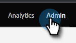
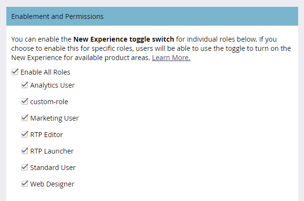
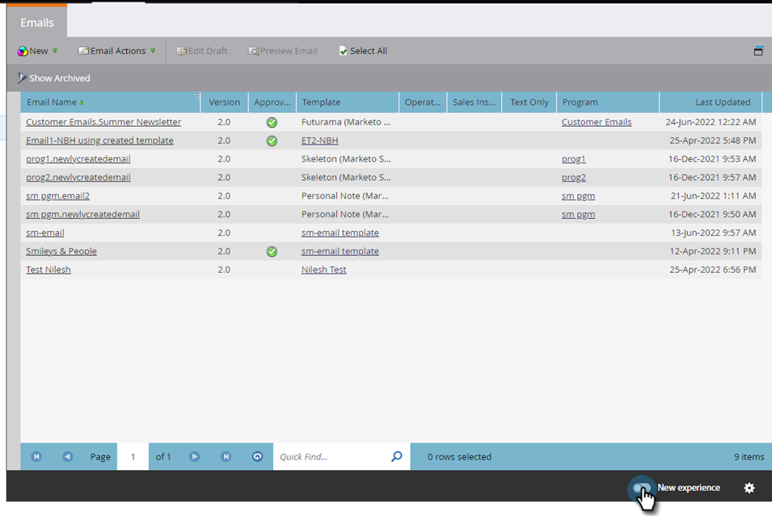

# Schakelen tussen schakelen {#toggle-switch}

Met de schakeloptie schakelt u tussen de klassieke Marketo-interface en de Moderne UX. Het is beschikbaar in alle hieronder gemarkeerde gebieden.

>[!NOTE]
>
>Als de schakeloptie in-/uitschakelen is geselecteerd, worden alle bestaande workflows automatisch opgeslagen voordat de gebruikersinterface wordt gewijzigd. Als een bewerking al wordt uitgevoerd (bijvoorbeeld: een element wordt momenteel goedgekeurd), ontvangt u een foutbericht waarin dit wordt aangegeven. Probeer het opnieuw nadat de bewerking is voltooid.

## Schakel schakelen tussen voor afzonderlijke rollen {#enable-the-toggle-switch-for-individual-roles}

Schakel de schakeloptie voor afzonderlijke rollen of alle rollen in. Zo gaat het.

1. Klik in Marketo Engage op **[!UICONTROL Admin]** .

   

1. Klik op **[!UICONTROL New Experience]**.

   

1. Selecteer de rol(en) die u wilt gebruiken voor de schakeloptie.

   

## Inschakelen voor functies {#enable-for-features}

U kunt de Marketo Engage Modern UX handmatig inschakelen voor afzonderlijke functies of voor alle beschikbare (huidige en toekomstige) functies.

In een gebied dat momenteel de Schakelaar van de Knevel (in dit voorbeeld zijn wij in de Mening van de Lijst E-mail) heeft, klik eenvoudig de knevel op het bodemrecht van de pagina.

De nieuwe ervaring wordt geladen.

Om het voor _alle_ eigenschappen toe te laten, klik het tandwielpictogram naast de knevelschakelaar.

Selecteer **[!UICONTROL Enable for all available features]** en klik op **[!UICONTROL OK]** .

## Beschikbare functies {#available-features}

De volgende functies zijn momenteel beschikbaar in de Moderne UX (waarbij elke versie nieuwe functies toevoegt):

* E-maildetails weergeven
* E-maillijstweergave
* E-mailsjabloondetails weergeven
* E-mailsjabloonlijst
* Dashboardweergave e-mailen
* Formulierdetails weergeven
* Formulierlijstweergave
* Pagina met details over afbeeldingen en bestanden
* Weergave Landingspagina
* Weergave landingspagina
* Details landingspagina
* Sjabloonlijst bestemmingspagina
* Gedetailleerde weergave van fragmenten
* Fragmentlijstweergave
