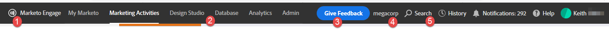

# Overzicht {#overview}

Welkom bij de Marketo Engage-ervaring van de volgende generatie, een nieuwe interface die de bruikbaarheid en een nieuwe look en feel biedt voor het hele Marketo-platform.

>[!PREREQUISITES]
>
>Als uw team van IT Webtoegang gebruikend een lijst van gewenste personen beperkt, vraag hen om de volgende domeinen (met inbegrip van de asterisk) toe te voegen om alle middelen en websockets van de Marketo toe te staan:
>
>* *.marketo.com
>* *.marketodesigner.com
>* *.mktoweb.com

## Neem de Rondleiding {#take-the-tour}

Bij eerste login, zal pop-up verschijnen, klaar om u de ondergang van de nieuwe ervaring te geven. Hoofden omhoog, als u verkiest om het over te slaan, zal het **not** later beschikbaar zijn.

De tour leidt je door alles wat je moet weten!

## Nieuwe functies {#whats-new}

Er is veel nieuwe functionaliteit in deze volgende-gen ervaring, die allen wordt ontworpen om uw marketing ervaring beduidend te verbeteren.

**Pictogrammen**

De nieuwe interfaceeigenschappen verbeteren en breidden iconografie uit. Meer informatie hierover vindt u hier: [Nieuwe woordenlijst van pictogrammen](/help/marketo/product-docs/marketo-engage-next-generation-experience/new-icon-glossary.md).

**Boom**

De boom is ook geüpgraded.

**Algemene navigatie**

Tot ziens superbal. U hebt nu snel toegang tot alle belangrijke secties van de Marketo.

**Instantie-URL**

U hebt ook snel toegang tot uw insteekmodule-id, die nu wordt weergegeven in de URL van uw exemplaar (nog nuttiger voor gebruikers met meerdere abonnementen).

## Nieuwe structuuropties {#new-tree-options}

Er zijn veel nieuwe boomfuncties beschikbaar.

**Marketo Classic vs. de nieuwe markt**

<table> 
 <tbody>
  <tr>
   <th>Functie</th> 
   <th>Klassiek</th> 
   <th>Next-gen</th> 
  </tr>
  <tr>
   <td>Meerdere filters tegelijk toepassen</td> 
   <td></td> 
   <td><strong>X</strong></td>  
  </tr>
  <tr>
   <td>Knooppunt van concept- en goedkeuringsstructuur</td> 
   <td></td> 
   <td><strong>X</strong></td> 
  </tr>
  <tr>
   <td>Lokale elementen maken in programmamappen</td> 
   <td></td> 
   <td><strong>X</strong></td> 
  </tr>
  <tr>
   <td>Dubbelklikken om boomknooppunten uit of samen te vouwen</td> 
   <td><strong>X</strong></td> 
   <td><strong>X</strong></td>  
  </tr>
  <tr>
   <td>Slepen en neerzetten van boom naar betrokkenheidsstroom</td> 
   <td><strong>X</strong></td> 
   <td></td> 
  </tr>
  <tr>
   <td>Slepen en neerzetten in de boomstructuur</td> 
   <td><strong>X</strong></td> 
   <td><strong>X</strong></td> 
  </tr>
  <tr>
   <td>Filteren op elementtype en statussen</td> 
   <td><i>gedeeltelijk</i></td> 
   <td><strong>X</strong></td>  
  </tr>
  <tr>
   <td>Achtergrond markeren om hiërarchie in focusstatus weer te geven</td> 
   <td></td> 
   <td><strong>X</strong></td> 
  </tr>
  <tr>
   <td>Trefwoorden markeren tijdens zoeken</td> 
   <td></td> 
   <td><strong>X</strong></td> 
  </tr>
  <tr>
   <td>Horizontaal schuiven</td> 
   <td><strong>X</strong></td> 
   <td><strong>X</strong></td>  
  </tr>
  <tr>
   <td>Status van aanwijzen van boomknooppunten</td> 
   <td><strong>X</strong></td> 
   <td><strong>X</strong></td> 
  </tr>
  <tr>
   <td>Hele boomstructuur snel samenvouwen</td> 
   <td></td> 
   <td><strong>X</strong></td> 
  </tr>
  <tr>
   <td>Snel samenvouwen tot hoofdknooppunt</td> 
   <td></td> 
   <td><strong>X</strong></td>  
  </tr>
  <tr>
   <td>Real-time update</td> 
   <td></td> 
   <td><strong>X</strong></td> 
  </tr>
  <tr>
   <td>Residuele boom</td> 
   <td><strong>X</strong></td> 
   <td><strong>X</strong></td> 
  </tr>
  <tr>
   <td>Zoeken in gearchiveerde mappen</td> 
   <td></td> 
   <td><strong>X</strong></td>  
  </tr>
  <tr>
   <td>Zoektekenreeks opgeslagen bij invoeren van algemene zoekopdracht in boomstructuurzoekopdracht</td> 
   <td></td> 
   <td><strong>X</strong></td> 
  </tr>
  <tr>
   <td>Alle werkruimten in één boomstructuur tonen</td> 
   <td><strong>X</strong></td> 
   <td><strong>X</strong></td> 
  </tr>
  <tr>
   <td>Statusbadge en knopinfo</td> 
   <td></td> 
   <td><strong>X</strong></td>  
  </tr>
  <tr>
   <td>Zoeklogica 'Woord begint met'</td> 
   <td><strong>X</strong></td> 
   <td><strong>X</strong></td> 
  </tr>
 </tbody>
</table>

## Globaal Nav {#global-nav}

Kijk eens naar de nieuwe Global Nav.

<table> 
 <tbody>
  <tr>
   <td>1</td> 
   <td>Geen superball drop-down meer</td> 
  </tr>
  <tr>
   <td>2</td> 
   <td>Alle vorige superbalkobjecten weergegeven</td> 
  </tr>
  <tr>
   <td>1</td> 
   <td>Op deze manier kun je feedback geven over je MEUE-ervaring</td> 
  </tr>
  <tr>
   <td>4</td> 
   <td>Als u meerdere abonnementen hebt, klikt u op de subnaam om gemakkelijk over te schakelen naar een andere naam</td> 
  </tr>
  <tr>
   <td>5</td> 
   <td>Globale zoekopdracht - u kunt nu uw volledige exemplaar van hier zoeken</td> 
  </tr>
 </tbody>
</table>

>[!NOTE]
>
>Alles wat vroeger in de superball drop-down leefde, is nog beschikbaar als tegels in Mijn Marketo.

>[!TIP]
>
>Het gebruiken van het onderzoek in de boom zal slechts resultaten van de sectie opleveren u in bent (b.v., de Activiteiten van de Marketing). Gebruik de algemene zoekopdracht als u de hele zoekopdracht wilt doorzoeken.

Geniet van de nieuwe Marketo Engage-ervaring en deel uw feedback!
