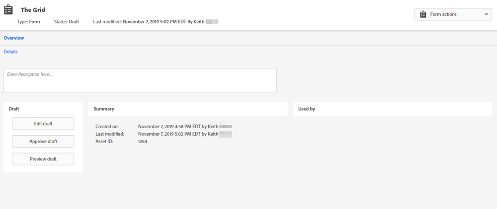

# Schakelaar schakelen {#toggle-switch}

Met de schakeloptie kunt u schakelen tussen de klassieke Marketo-interface en de Marketo Engage-ervaring van de volgende generatie. Het is beschikbaar in alle hieronder gemarkeerde gebieden. Vanaf de release van mei 2022 wordt de volgende generatie standaard ingeschakeld.

>[!NOTE]
>
>Als de schakeloptie in-/uitschakelen is geselecteerd, worden alle bestaande workflows automatisch opgeslagen voordat de gebruikersinterface wordt gewijzigd. Als een bewerking al wordt uitgevoerd (bijvoorbeeld: een middel wordt goedgekeurd), zult u een foutenmelding ontvangen die als dusdanig wijst en zou opnieuw moeten proberen nadat de verrichting wordt voltooid.

## Schakel schakelen tussen voor afzonderlijke rollen {#enable-the-toggle-switch-for-individual-roles}

Schakel de schakeloptie voor afzonderlijke rollen of alle rollen in. Zo gaat het.

1. Klik in Marketo Engage op **Beheer**.

   

1. Klikken **Nieuwe ervaring**.

   

1. Selecteer de rol(en) die u wilt gebruiken voor de schakeloptie.

   

## Weergave landingspagina {#landing-page-list-view}

De volgende-gen Landing van de lijstmening van de Pagina biedt onderzoeksfilters en de capaciteit aan om massa uit te voeren die de acties van de Pagina.

1. Selecteer in Marketo **Design Studio**.

   

1. Selecteren **Openingspagina&#39;s**.

   

1. Klik rechtsonder op de pagina op de knop **Nieuwe ervaring** schakelen.

   

De nieuwe ervaring wordt geladen.

## Weergave Landingspagina {#landing-page-details-view}

1. Zoek in Marketo de bestemmingspagina en selecteer deze.

   

1. Klik rechtsonder op de pagina op de knop **Nieuwe ervaring** schakelen.

   

De nieuwe ervaring wordt geladen.

## Formuliergegevens pagina {#form-details-page}

1. Zoek en selecteer het formulier in Marketo.

   

1. Klik rechtsonder op de pagina op de knop **Nieuwe ervaring** schakelen.

   

De nieuwe ervaring wordt geladen.

## Formulierlijstweergave {#form-list-view}

1. Selecteer in Marketo **Design Studio**.

   

1. Selecteren **Forms**.

   

1. Klik rechtsonder op de pagina op de knop **Nieuwe ervaring** schakelen.

   

De nieuwe ervaring wordt geladen.

## E-mailsjabloondetails weergeven {#email-template-details-view}

1. Selecteer in Marketo **Design Studio**.

   

1. Selecteer de gewenste e-mailsjabloon.

   

1. Klik rechtsonder op de pagina op de knop **Nieuwe ervaring** schakelen.

   

De nieuwe ervaring wordt geladen.

## E-maildetails weergeven {#email-details-view}

1. Zoek en selecteer je e-mailadres in Marketo.

   

1. Klik rechtsonder op de pagina op de knop **Nieuwe ervaring** schakelen.

   

De nieuwe ervaring wordt geladen.

## E-maillijstweergave {#email-list-view}

De e-maillijstweergave van de volgende generatie biedt zoekfilters en de mogelijkheid om massa-e-mailhandelingen uit te voeren.

1. Selecteer in Marketo **Design Studio**.

   

1. Selecteren **E-mails**.

   

1. Klik rechtsonder op de pagina op de knop **Nieuwe ervaring** schakelen.

   

De nieuwe ervaring wordt geladen.

## Inschakelen voor alle functies {#enable-for-all-features}

U kunt de volgende-gen interface van Marketo handmatig inschakelen voor alle beschikbare functies, zowel de huidige als de toekomstige.

1. In een gebied dat momenteel de Schakelaar van de Wissel heeft (in dit voorbeeld zijn wij binnen [Formuliergegevens pagina](#form-details-page)), klikt u op het tandwielpictogram rechtsonder op de pagina.

   

1. Selecteren **Inschakelen voor alle beschikbare functies** en klik op **OK**.

   
