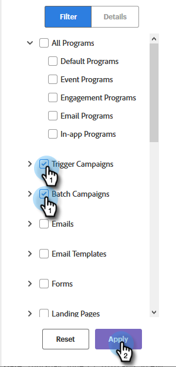

# De algemene zoekopdracht gebruiken {#using-the-global-search}

De krachtige algemene zoekopdracht biedt u veel opties zonder beperkingen op de weergegeven resultaten.

## Resultaten automatisch aanvullen {#autocomplete-results}

Soms zal autocomplete je snel laten zien wat je zoekt.

1. In Globale Nav, klik **Onderzoek**.

   

1. Typ tekst voor het element dat u wilt identificeren.

   

1. Zoekresultaten worden automatisch voltooid weergegeven. U kunt overal in om het even welke broodkruimels klikken die rechtstreeks aan dat punt moeten worden genomen.

   

1. In dit voorbeeld kiezen we ervoor om rechtstreeks naar de lijst te gaan die we zoeken. Klik op de naam van de lijst.

   

U wordt rechtstreeks naar de gewenste lijst geleid.

## Algemene zoekresultaten {#global-search-results}

Gebruik de volledige zoekopdracht als de resultaten van Automatisch aanvullen u niet laten zien wat u zoekt.

1. In Globale Nav, klik **Onderzoek**.

   

1. Typ tekst voor het element en klik op **Zoeken**.

   

1. De pagina Algemene zoekresultaten wordt geopend.

   

<table> 
 <tbody>
  <tr>
   <td>1</td> 
   <td>Klik op de eerste (of enige) pagina van al uw zoekresultaten op een willekeurige plaats in de broodkruimels die direct naar dat gebied moeten worden geleid</td> 
  </tr>
  <tr>
   <td>2</td> 
   <td>Datums/tijden waarop het item is gemaakt/laatstelijk gewijzigd</td> 
  </tr>
  <tr>
   <td>1</td> 
   <td>Kies een specifieke Marketo-hoofdsectie die u wilt doorzoeken of doorzoeken in één keer</td> 
  </tr>
  <tr>
   <td>4</td> 
   <td>Gerichte filters implementeren om de zoekresultaten te beperken</td> 
  </tr>
 </tbody>
</table>

OPTIONELE STAP: Als u filters wilt gebruiken, kiest u de gewenste opties en klikt u op **Toepassen**.

OPTIONELE STAP: Als u de details van een item wilt zien, klikt u in de witruimte van de rij.

OPTIONELE STAP: Als u rechtstreeks naar het laatste item in een broodkruimel wilt gaan, klikt u erop OF houdt u de muisaanwijzer boven de spatie in de rij totdat het pictogram hieronder wordt weergegeven en klikt u erop.

