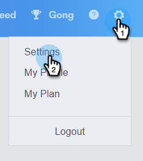
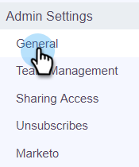

# Geblokkeerde domeinen {#blocked-domains}

Help uw verkoopteam succes te behalen door te voorkomen dat zij per ongeluk concurrenten, bekende spamvallen of andere domeinen waarmee u geen contact wilt opnemen per e-mail verzenden.

>[!NOTE]
>
>**Vereiste Bevoegdheden Admin**

1. Klik in de webtoepassing op het tandwielpictogram en selecteer **[!UICONTROL Settings]** .

   

1. Klik onder [!UICONTROL Admin Settings] op **[!UICONTROL General]** .

   

1. Voer het domein in dat u wilt blokkeren en klik op **[!UICONTROL Block Domain]** .

   

   >[!NOTE]
   >
   >E-mail die deel van e-mail van de a [ Groep ](/help/marketo/product-docs/marketo-sales-connect/email/using-the-compose-window/sending-emails-via-group-email.md) uitmaken verzendt die wegens wordt verzonden naar een geblokkeerd e-maildomein ontbreekt zal stil ontbreken en niet in de ontbroken e-mailomslag verschijnen.
