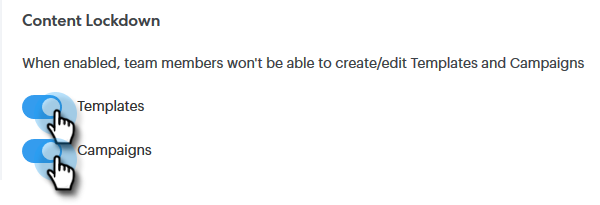

# Inhoud vergrendelen {#content-lockdown}

Als u de inhoud vergrendelt, voorkomt u dat gebruikers van andere leveranciers sjablonen en/of campagnes bewerken. Gebruikers kunnen geen inhoud delen, klonen, bewerken of verwijderen. Ze hebben ook geen optie om sjablonen te archiveren.

>[!NOTE]
>
>De gebruikers **zullen** nog de inhoud van een e-mail kunnen uitgeven op het tijdstip van het verzenden, of wanneer het lanceren van een campagne.

1. Klik in [!UICONTROL Sales Connect] op het instellingenpictogram en selecteer **[!UICONTROL Settings]** .

   

1. Klik onder [!UICONTROL Admin Settings] op **[!UICONTROL General]** .

   

1. Omlaag schuiven naar [!UICONTROL Content Lockdown] . Het draaien van één van beide schuif zal __ onbruikbaar maken uw teamleden&#39; capaciteit om malplaatjes en/of campagnes tot stand te brengen/uit te geven.

   
