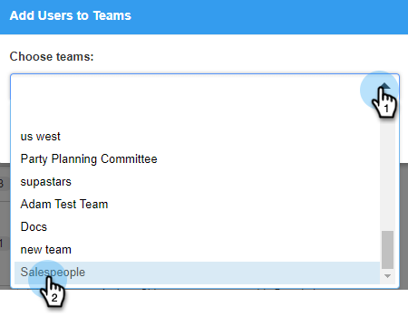

# Een subteam maken {#create-a-sub-team}

## Een subteam maken {#create-a-sub-team-1}

1. Klik op het tandwielpictogram en selecteer **[!UICONTROL Settings]** .

   

1. Selecteer onder [!UICONTROL Admin Settings] de optie **[!UICONTROL Team Management]** .

   

1. Naast [!UICONTROL All Teams], klik **+**.

   

1. Voer een teamnaam (en optionele beschrijving) in en klik op **[!UICONTROL Create]** .

   

   >[!NOTE]
   >
   >U kunt nu sjablonen, campagnes en groepen delen met dat team.

## Personen toevoegen aan uw subteam {#add-people-to-your-sub-team}

1. Selecteer de groep [!UICONTROL Team Management] , die zich nog in **[!UICONTROL Everyone]** bevindt.

   

1. Zoek de gebruikers die u aan het subteam wilt toevoegen en schakel het selectievakje in.

   

1. Klik op **[!UICONTROL Add Selected to Teams]**.

   

1. Klik op de vervolgkeuzelijst en selecteer de gewenste team(s).

   

1. Klik op **[!UICONTROL Add To Teams]** als u klaar bent.

   
