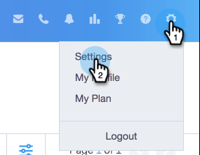
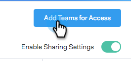

# Instellingen voor delen {#sharing-settings}

U kunt uw sjablonen beter beheren door te beperken wat gebruikers kunnen delen en met welke categorieën.

Wanneer uw Sales Connect-account voor het eerst wordt gemaakt, wordt [!UICONTROL Sharing Settings] ingeschakeld. Hierdoor krijgen uw accountbeheerders de mogelijkheid om uw sjablooncategorieën te maken en in te delen voordat ze de poorten openen en gebruikers de mogelijkheid bieden inhoud te delen in uw teamcategorieën.

Wanneer [!UICONTROL Sharing Settings] is ingeschakeld, kunnen alleen beheerders in categorieën delen, tenzij een team of iedereen over gedeelde rechten beschikt. Als [!UICONTROL Sharing Settings] is uitgeschakeld, zijn er geen beperkingen en kunnen alle gebruikers delen in sjablooncategorieën.

## Uw instellingen voor delen configureren {#configure-your-sharing-settings}

1. In de [&#x200B; Webtoepassing &#x200B;](https://toutapp.com/login), ga naar de [!UICONTROL Settings] pagina.

   

1. Selecteer onder [!UICONTROL Admin Settings] de optie **[!UICONTROL Sharing Access]** .

   

1. Zorg ervoor dat **[!UICONTROL Sharing Settings]** is ingeschakeld. Dit betekent standaard dat alleen beheerders sjablonen kunnen delen in uw sjablooncategorieën.

   

1. Selecteer de Categorie van het Malplaatje u wilt vormen.

   

1. Klik op **[!UICONTROL Add Teams for Access]**.

   

1. Selecteer de teams die u wilt toevoegen.

   

   >[!NOTE]
   >
   >Als u geen teams ziet, zult u naar het Beheer van het Team moeten gaan en een team van gebruikers creëren.

1. Klik op **[!UICONTROL Add Teams for Access]** om op te slaan.

   

1. Nu uw team is toegevoegd, kunt u selecteren om alleen teambeheerders toe te staan om te delen of alle gebruikers in dat team. In dit voorbeeld hebben we alle gebruikers van het SDR-team toegang gegeven.

   
