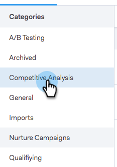

# Instellingen voor delen {#sharing-settings}

U kunt uw sjablonen beter beheren door te beperken wat gebruikers kunnen delen en met welke categorieën.

Wanneer uw Sales Connect-account voor de eerste keer wordt gemaakt, zijn Instellingen voor delen ingeschakeld. Hierdoor krijgen uw accountbeheerders de mogelijkheid om uw sjablooncategorieën te maken en in te delen voordat ze de poorten openen en gebruikers de mogelijkheid bieden inhoud te delen in uw teamcategorieën.

Wanneer het Delen van Montages wordt toegelaten, slechts zullen de beheerders in categorieën kunnen delen tenzij het delen van voorrechten aan een team of iedereen wordt verstrekt. Als Instellingen voor delen zijn uitgeschakeld, zijn er geen beperkingen en kunnen alle gebruikers de inhoud van elke sjablooncategorie delen.

## Uw instellingen voor delen configureren {#configure-your-sharing-settings}

1. Ga in de [webtoepassing](http://toutapp.com/login)naar de pagina Instellingen.

   

1. Selecteer Toegang **** delen onder Beheerinstellingen.

   

1. Zorg ervoor dat **Instellingen** voor delen zijn ingeschakeld. Dit betekent standaard dat alleen beheerders sjablonen kunnen delen in uw sjablooncategorieën.

   

1. Selecteer de Categorie van het Malplaatje u wilt vormen.

   

1. Klik op Teams **toevoegen voor toegang**.

   

1. Selecteer de teams die u wilt toevoegen.

   

   >[!NOTE]
   >
   >Als u geen teams ziet, zult u naar het Beheer van het Team moeten gaan en een team van gebruikers creëren.

1. Klik op Teams **toevoegen om op te slaan voor toegang** .

   

1. Nu uw team is toegevoegd, kunt u selecteren om alleen teambeheerders toe te staan om te delen of alle gebruikers in dat team. In dit voorbeeld hebben we alle gebruikers van het SDR-team toegang gegeven.

   

