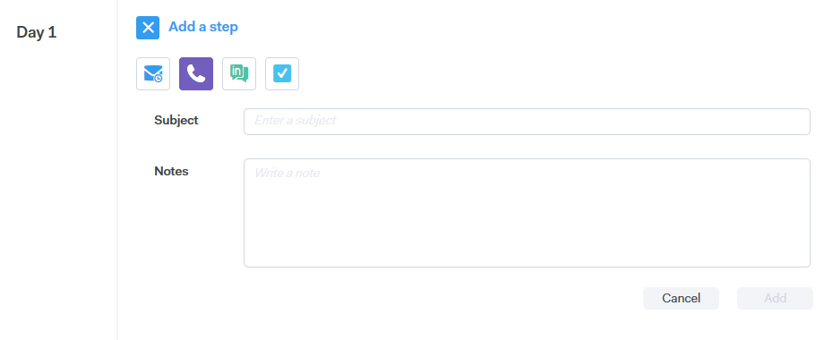

# Typen campagneringstap {#campaign-step-types}

Wanneer u een stap toevoegt aan uw campagne, hebt u vier opties.

## E-mail {#email}

Stel een nieuw e-mailbericht samen of gebruik een bestaande sjabloon.

| **Gebruik een Malplaatje** | Selecteer een van uw bestaande sjablonen |
|---|---|
| **sparen als Malplaatje** | E-mail opslaan die u net hebt samengesteld als een nieuwe sjabloon |
| **voeg Inhoud** toe | Upload een bestand naar onze server en ontvang een URL (die naar de inhoud verwijst) die in uw e-mail kan worden gevolgd |
| **maak Dossiers** vast | Een bestand vanaf uw computer bijvoegen bij het e-mailbericht (maximaal 23 MB) |

>[!TIP]
>
>Leer de details over uw [ verzendende opties ](/help/marketo/product-docs/marketo-sales-connect/campaigns/understanding-send-options.md).

## Bellen {#call}

Plaats een herinnering aan follow-up met een contact via telefoon. U kunt nota&#39;s ook bewaren die als besprekingsspoor tijdens de vraag moeten worden gebruikt.

## InMail {#inmail}

Het volgen op veelvoudige kanalen is een uitstekende manier om met lood te verbinden. Met InMail-taken kunt u een herinnering instellen die u via [!DNL LinkedIn] kunt bereiken.

## Aangepaste taak {#custom-task}

Gebruik aangepaste taken als de bovenstaande opties niet van toepassing zijn. U kunt bijvoorbeeld een collega uitnodigen om via e-mail een lead te volgen.

