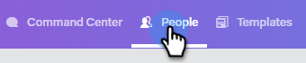

# Personen uit een campagne verwijderen {#remove-people-from-a-campaign}

U kunt een Campagne automatisch beëindigen wanneer een ontvanger antwoordt. En je kunt ervoor kiezen om de campagne te laten zien als een &#39;succes&#39; voor die ontvanger.

Als u dit wilt instellen, nadat u uw campagne hebt gemaakt, schakelt u gewoon de selectievakjes Abonneren in het gedeelte Instellingen van het tabblad Campagnes in. Beide opties beëindigen de campagne en uw ontvanger ontvangt geen e-mails meer van u. Dit werkt alleen als u antwoord bijhoudt.

Bovendien kunt u personen uit de campagne zelf verwijderen, personen uit een campagne op de pagina Personen verwijderen en een hele groep personen verwijderen. Laten we eens kijken naar de drie onderstaande methoden.

## Een persoon rechtstreeks uit een campagne verwijderen {#remove-a-person-directly-from-a-campaign}

1. Klik in Sales Connect op de knop **Campagnes** tab.

   

1. Zoek uw campagne en selecteer deze.

   

1. Uw campagne wordt rechts weergegeven. Klik ergens op om het te openen.

   

1. Zoek de persoon die u wilt verwijderen en klik op **Verwijderen**.

   

1. (OPTIONELE STAP) U kunt ook meerdere personen tegelijk verwijderen door op het selectievakje naast hun naam te klikken en op de knop **Verwijderen** bovenaan.

   

## Een persoon verwijderen uit een campagne op de pagina Personen {#remove-a-person-from-a-campaign-within-the-people-page}

1. Klik in Sales Connect op de knop **Mensen** tab.

   

1. Zoek en selecteer de persoon die u wilt verwijderen.

   

1. Aan de rechterkant wordt het deelvenster Gedetailleerde weergave van hun persoon geopend. Klik op de knop **Historie** gevolgd door de **Verwijderen** knop.

   

## Een groep personen verwijderen uit een campagne {#remove-a-group-of-people-from-a-campaign}

1. Klik in Sales Connect op de knop **Mensen** tab.

   

1. Zoek en selecteer de groep onder **Mijn groepen**.

   

1. Selecteer de personen die u wilt verwijderen.

   

1. Klikken **Handelingen** en kiest u **Geselecteerde verwijderen uit campagne**.

   
