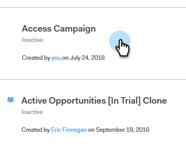

# Weekends overslaan {#skip-weekends}

Wanneer u een campagne automatiseert, wilt u waarschijnlijk niet dat uw e-mails op zaterdag of zondag verschijnen. Zo niet, dan kunt u weekends overslaan.

1. Klik in Sales Connect op de knop **Campagnes** tab.

   

1. Zoek en selecteer uw campagne.

   

1. Klikken **Instellingen**.

   

1. Selecteer **Weekends overslaan** selectievakje.

   

   >[!NOTE]
   >
   >Zonder het weekend over te slaan, worden uw e-mails gepland op basis van een normale week van 7 dagen.
