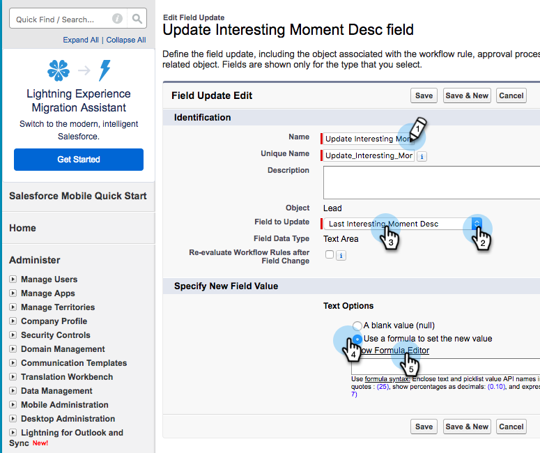
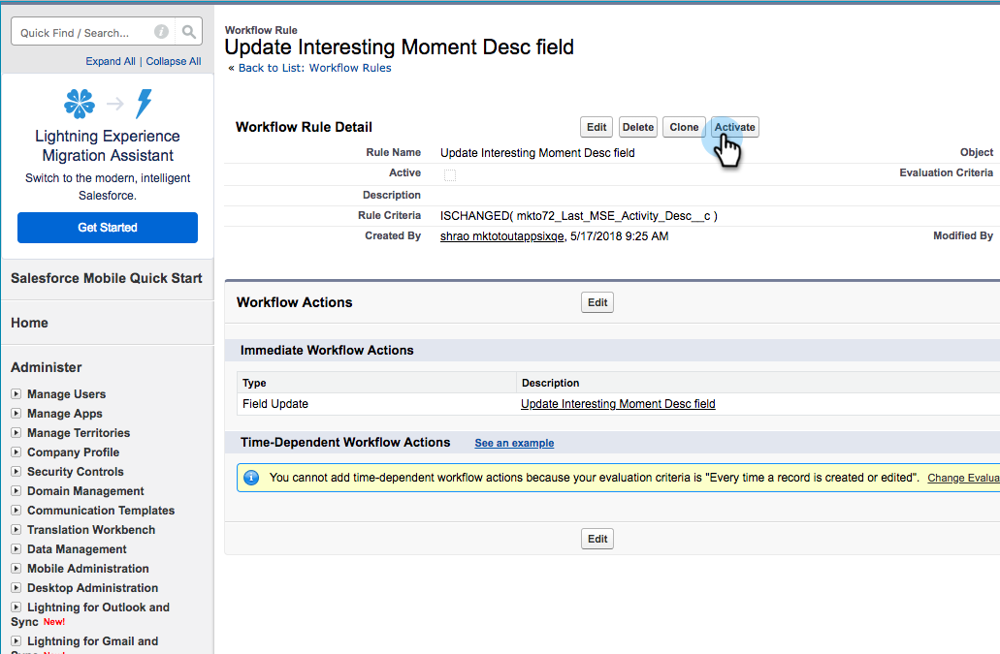

# Workflowregels maken in Salesforce {#creating-workflow-rules-in-salesforce}

Als u tegelijkertijd Marketo Sales Insight (MSI) en Marketo Sales Connect (MSC) gebruikt, wordt de functie MSI Best Bets in [!DNL Salesforce] niet bijgewerkt. Alle andere MSI-functies werken zoals gewoonlijk (interessante momenten in het iFrame weergeven, e-mail verzenden, aan campagnes toevoegen, enz.). Dit artikel biedt een oplossing om Best Bets weer te laten werken.

>[!NOTE]
>
>Dit beïnvloedt slechts klanten die **zowel** MSI als MSE gebruiken, en die de Beste eigenschap van Bets in MSI willen gebruiken. Als u geen Best Bets nodig hebt/gebruikt, kunt u dit negeren.

## Aan de slag {#getting-started}

De oplossing omvat het maken van nieuwe workflowregels om waarden van nieuwe MSE-velden te kopiëren naar de oude MSI-velden. U moet vier workflowregels maken voor het object Contact en dezelfde vier workflowregels voor het object Lead in uw eigen [!DNL Salesforce] -instantie. Dit kan u vereisen om de Admin van CRM rechten (afhankelijk van uw rol en opstelling in CRM) te hebben.

Hieronder vindt u de aanbevolen namen van de workflowregels en een beschrijving van de workflowregels. Deze zijn van toepassing op het object [!UICONTROL Contact] en [!UICONTROL Lead] :

<table>
 <colgroup>
  <col>
  <col>
 </colgroup>
 <tbody>
  <tr>
   <td>Interessant momebeschrijving bijwerken</td>
   <td>
Exemplaar van: Laatste het Exemplaar van Marketo van de Aanwezigheid Desc   aan: Laatste het Interesten Desc van het Moment
</td>
  </tr>
  <tr>
   <td>Het veld Interessentype van moment bijwerken</td>
   <td>
Exemplaar van: Het laatste Type van Betrokkenheid van Marketo   Exemplaar aan: Het Laatste Interesserende Type van Momentype
</td>
  </tr>
  <tr>
   <td>Het veld Interessant moment Source bijwerken</td>
   <td>
Exemplaar van: Het laatste Exemplaar van Marketo Betrokkenheid Source   aan: Laatste Interessant Moment Source
</td>
  </tr>
  <tr>
   <td>Veld voor datum van interessant moment bijwerken</td>
   <td>
Exemplaar van: Het laatste Exemplaar van de Datum van de Betrokkenheid van Marketo   aan: Laatste het Interesten Datum van de Momentane
</td>
  </tr>
 </tbody>
</table>

## Instructies {#instructions}

1. Na het klikken **[!UICONTROL Setup]**, onderzoek naar **Werkschema** en selecteer **[!UICONTROL Workflow Rules]**.

   

1. Selecteer **[!UICONTROL New Rule]**.

   

1. Klik op de vervolgkeuzelijst [!UICONTROL Object] en selecteer **[!UICONTROL Lead]** en klik vervolgens op **[!UICONTROL Next]** .

   

1. Voer &quot;Interessent momentbeschrijving bijwerken&quot; in als de [!UICONTROL Rule Name] . Selecteer het keuzerondje **[!UICONTROL created, and every time it’s edited]** . Selecteer [!UICONTROL Rule Criteria] in de vervolgkeuzelijst **[!UICONTROL formula evaluates to true]** . Zoek naar en selecteer de ISCHANGED functie. Markeer vervolgens de standaardwaarde van het veld en klik op **[!UICONTROL Insert Field]** .

   

1. Kies [!UICONTROL Insert Field] in het pop-upmenu **[!UICONTROL Last Marketo Engagement Desc]** en klik op **[!UICONTROL Insert]** .

   

1. Klik op **[!UICONTROL Save & Next]**.

   

1. Selecteer [!UICONTROL Add Workflow Action] in de vervolgkeuzelijst **[!UICONTROL New Field Update]** .

   

1. Voer in het veld [!UICONTROL Name] het veld &quot;Interesten momentbeschrijving bijwerken&quot; in ([!UICONTROL Unique Name] wordt automatisch gegenereerd). Kies [!UICONTROL Field to Update] in de vervolgkeuzelijst **[!UICONTROL Last Interesting Moment Desc]** . Selecteer het keuzerondje **[!UICONTROL Use a formula to set new value]** en klik op **[!UICONTROL Show Formula Editor]** .

   

1. Klik op **[!UICONTROL Insert Field]** .

   

1. Selecteer **[!UICONTROL Last Marketo Engagement Desc]** en klik op **[!UICONTROL Insert]** . Klik op de volgende pagina op **[!UICONTROL Save]** .

   

1. Klik op **[!UICONTROL Done]**.

   

1. Klik op **[!UICONTROL Activate]** om de workflowregel in te schakelen.

   

   Na de laatste stap kunt u de workflowregel klonen voor de andere velden die in de sectie [!UICONTROL Getting Started] worden vermeld: Desc, Type, Source, Date. Nadat u de vier workflowregels in het [!UICONTROL Contact] -object hebt voltooid, herhaalt u dezelfde regel voor het [!UICONTROL Lead] -object.
