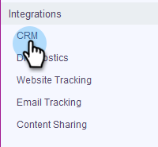

# Verkoopverbinding maken met uw Salesforce-sandbox {#how-to-connect-sales-connect-to-your-salesforce-sandbox}

>[!PREREQUISITES]
>
>Uw Sales Connect-account kan nog geen verbinding maken met Salesforce wanneer u een verbinding tot stand brengt met de sandbox. Zo ja, [zorg ervoor u losmaakt](/help/marketo/product-docs/marketo-sales-connect/crm/salesforce-integration/disconnect-salesforce-from-your-sales-connect-account.md) voordat u de stappen in dit artikel uitvoert.

1. Klik in Sales Connect op het tandwielpictogram rechtsboven en selecteer **Instellingen**.

   

1. Klik onder Integraties op **CRM**.

   

1. Klik op de Salesforce-kaart op **Meer informatie**.

   

1. Klik onder aan de pagina op **Verbinding maken met sandbox**.

   

   >[!NOTE]
   >
   >Als u reeds aan uw Salesforce Sandbox rekening wordt het programma geopend, zult u aan een pagina van de Vergunning worden genomen waar u toegang zult moeten verlenen. Als u nog niet bent aangemeld, gaat u verder met stap 5.

1. Voer de gebruikersnaam en het wachtwoord van uw Salesforce Sandbox-account in.

   

>[!MORELIKETHIS]
>
>[Hoe te om Aanpassingen in Uw zandbak van Salesforce te installeren](/help/marketo/product-docs/marketo-sales-connect/crm/salesforce-customization/how-to-install-customizations-in-your-salesforce-sandbox.md)
