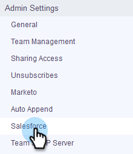

# Aanpassingen installeren in uw Salesforce-sandbox {#how-to-install-customizations-in-your-salesforce-sandbox}

>[!NOTE]
>
>**Vereiste Bevoegdheden Admin**

>[!PREREQUISITES]
>
>[&#x200B; verbindt Verkoop met Uw zandbak van Salesforce &#x200B;](/help/marketo/product-docs/marketo-sales-connect/crm/salesforce-customization/how-to-connect-sales-connect-to-your-salesforce-sandbox.md)

1. Klik in [!DNL Sales Connect] op het tandwielpictogram rechtsboven en selecteer **[!UICONTROL Settings]** .

   

1. Klik onder [!UICONTROL Admin Settings] op **[!UICONTROL Salesforce]** .

   

1. Klik op **[!UICONTROL Install Customizations]**.

   

   Ga vervolgens gewoon door met de stappen om de aanpassing te installeren zoals u zou doen op een gewone [!DNL Salesforce] account.
