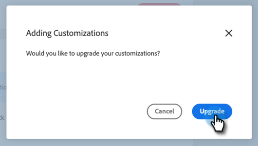

# [!DNL Sales Connect] Aanpassingen voor CRM {#sales-connect-customizations-for-crm}

De onderstaande velden en knoppen worden gemaakt met de metagegevens-API in Salesforce CRM. Zodra de gebieden worden gecreeerd, moeten de beheerders de paginalay-outs in hun CRM vormen om hen bloot te stellen. De instructies [ kunnen hier ](/help/marketo/product-docs/marketo-sales-connect/crm/salesforce-customization/assets/mse-for-sf-classic.pdf) worden gevonden.

## Aanpassingen installeren in [!DNL Salesforce] {#how-to-install-customizations-in-salesforce}

1. Klik in [!DNL Sales Connect] op het tandwielpictogram en selecteer **[!UICONTROL Settings]** .

   

1. Selecteer onder [!UICONTROL Admin Settings] de optie **[!UICONTROL Salesforce]** .

   

1. Klik op **[!UICONTROL Marketo Sales Engage Customizations]**.

   

1. Klik op **[!UICONTROL Connect to Salesforce]**.

   

1. Meld u aan bij [!DNL Salesforce] .

   

## [!DNL Salesforce] Aanpassing bijwerken {#update-salesforce-customization}

Updates voor het [!DNL Salesforce] Aanpassingspakket bevatten verbeteringen en foutoplossingen. Volg onderstaande stappen om te controleren of er updates beschikbaar zijn of om deze uit te voeren.

>[!NOTE]
>
>**vereiste toestemmingen Admin.**

1. In de [ Webtoepassing ](https://www.toutapp.com), klik het tandwielpictogram en selecteer **[!UICONTROL Settings]**.

   

1. Klik onder [!UICONTROL Admin Settings] op **[!UICONTROL Salesforce]** .

   

1. De [!DNL Sales Connect] Customization card geeft aan of er updates beschikbaar zijn. Klik op **[!UICONTROL Update Customizations]**.

   

1. Klik op **[!UICONTROL Upgrade]**.

   

1. Wacht tot de updates zijn geïnstalleerd. Afhankelijk van het aantal versienummers dat u nodig hebt, varieert de installatietijd.

   

Zodra u klaar bent, wordt op uw kaart vermeld dat uw aanpassingen voor Verkoopverbinding up-to-date zijn.

## Aangepaste activiteitsvelden {#custom-activity-fields}

Marketo zal de verwezenlijking van de nieuwe gebieden dan een eenmalige backfill van gegevens, een re-mapping, en een aan de gang zijnde synchronisatie van waarden in de **nieuwe** slechts gebieden ontdekken. Oude velden worden niet bijgewerkt.

<table><thead>
  <tr>
    <th>Veldnaam</th>
    <th>Beschrijving</th>
  </tr></thead>
<tbody>
  <tr>
    <td>Lokale aanwezigheid-id voor MSE-aanroep</td>
    <td>Als gebruiker kunt u Lokale Aanwezigheid als optie kiezen wanneer u vraag van de Telefoon MSE maakt. De inkomende vraag zal een lokaal aantal voor de ontvanger tonen.</td>
  </tr>
  <tr>
    <td>URL opnameoproep MSE</td>
    <td>De vraag kan worden geregistreerd en een verbinding voor de opname zal hier worden geregistreerd.</td>
  </tr>
  <tr>
    <td>MSE-campagne</td>
    <td>Logs name van de campagne MSE de Contact/Lead een lid van is.</td>
  </tr>
  <tr>
    <td>URL MSE-campagne</td>
    <td>Logs URL aan de campagne die in MSE werd gecreeerd. Als u hierop klikt, wordt de campagne geopend in de MSE-webapp.</td>
  </tr>
  <tr>
    <td>Huidige stap van MSE-campagne</td>
    <td>Als een contactpersoon/lead deel uitmaakt van een campagne, registreert dit veld de naam van de stap waarop de lead/contactpersoon momenteel is ingeschakeld.</td>
  </tr>
  <tr>
    <td>MSE-e-mailbijlage weergegeven</td>
    <td>Hiermee worden gegevens geregistreerd wanneer een e-mailbericht met een bijlage wordt verzonden en de bijlage door de ontvanger wordt bekeken.</td>
  </tr>
  <tr>
    <td>MSE-e-mail geklikt</td>
    <td>Logs a checkmark wanneer de ontvanger een verbinding in een e-mail klikt.</td>
  </tr>
  <tr>
    <td>MSE-e-mail gereageerd</td>
    <td>Logs a checkmark wanneer de ontvanger op een e-mail antwoordt.</td>
  </tr>
  <tr>
    <td>E-mailstatus MSE</td>
    <td>Geeft aan of een e-mail is verzonden/bezig is/wordt teruggestuurd (het bijhouden van teruggestuurde e-mails is afhankelijk van het gebruikte leveringskanaal).</td>
  </tr>
  <tr>
    <td>MSE-e-mailsjabloon</td>
    <td>Logs name van het malplaatje MSE dat in e-mail werd gebruikt die naar het lood/de contact wordt verzonden.</td>
  </tr>
  <tr>
    <td>URL E-mailsjabloon MSE</td>
    <td>Logs URL aan het malplaatje dat in MSE werd gecreeerd. Als u hierop klikt, wordt de sjabloon geopend in de MSE-webapp.</td>
  </tr>
  <tr>
    <td>URL MSE-e-mail</td>
    <td>Als u op deze URL klikt, wordt Command Center in MSE geopend en wordt het tabblad Historie van Personendetails weergegeven waarop u het verzonden e-mailbericht kunt zien.</td>
  </tr>
  <tr>
    <td>MSE-e-mail weergegeven</td>
    <td>Logs a checkmark wanneer de ontvanger een e-mail bekijkt.</td>
  </tr>
</tbody></table>

## Logboekvelden oprollen {#roll-up-logging-fields}

<table><thead>
  <tr>
    <th>Veldnaam</th>
    <th>Beschrijving</th>
  </tr></thead>
<tbody>
  <tr>
    <td>MSE - Laatste marketingservice</td>
    <td>Laatste inkomende betrokkenheid van Marketing.</td>
  </tr>
  <tr>
    <td>MSE - Datum laatste marketingovereenkomst</td>
    <td>Tijdstempel van de service van Marketing.</td>
  </tr>
  <tr>
    <td>MSE - Laatste marketingbetrokkenheidsbureau</td>
    <td>Beschrijving van de service.</td>
  </tr>
  <tr>
    <td>MSE - Last Marketing Engagement Source</td>
    <td>Source of Marketing-betrokkenheid.</td>
  </tr>
  <tr>
    <td>MSE - Laatste type marketingservice</td>
    <td>Type betrokkenheid.</td>
  </tr>
  <tr>
    <td>MSE - Laatste activiteit door verkoop</td>
    <td>Laatste uitgaande activiteit uitgevoerd door het verkoopteam.</td>
  </tr>
  <tr>
    <td>MSE - Laatste reactie</td>
    <td>Laatste e-mailantwoord op e-mail over verkoop.</td>
  </tr>
  <tr>
    <td>MSE - Huidige verkoopcampagne</td>
    <td>Logs name van de campagne MSE de lood/het contact is een lid van.</td>
  </tr>
  <tr>
    <td>MSE - Laatste verkoopbetrokkenheid</td>
    <td>Laatste inkomende service van Sales.</td>
  </tr>
  <tr>
    <td>MSE - Weigeren</td>
    <td>Veld voor uitschakelen.</td>
  </tr>
</tbody></table>

## Knoppen {#buttons}

<table><thead>
  <tr>
    <th>Knopnaam</th>
    <th>Beschrijving</th>
  </tr></thead>
<tbody>
  <tr>
    <td>MSE-e-mail verzenden</td>
    <td>Verkoop e-mails van Salesforce.</td>
  </tr>
  <tr>
    <td>Toevoegen aan MSE-campagne</td>
    <td>Toevoegen aan MSE-campagnes vanuit Salesforce.</td>
  </tr>
  <tr>
    <td>Naar MSE duwen</td>
    <td>Zet contact op van Salesforce naar MSE.</td>
  </tr>
  <tr>
    <td>Vraag met MSE</td>
    <td>Maak verkoopgesprekken vanuit Salesforce.</td>
  </tr>
</tbody>
</table>

## Knoppen Handeling bulksgewijs {#bulk-action-buttons}

<table><thead>
  <tr>
    <th>Knopnaam</th>
    <th>Beschrijving</th>
  </tr></thead>
<tbody>
  <tr>
    <td>Toevoegen aan MSE-campagne</td>
    <td>Toevoegen aan MSE-campagnes vanuit Salesforce.</td>
  </tr>
  <tr>
    <td>Naar MSE duwen</td>
    <td>Zet contact op van Salesforce naar MSE.</td>
  </tr>
</tbody>
</table>

## Gebruikershandleidingen {#user-guides}

[Aangepaste MSE-rapporten in Salesforce](/help/marketo/product-docs/marketo-sales-connect/crm/salesforce-customization/assets/reports-and-dashboards.pdf)

[MSE voor Salesforce Classic](/help/marketo/product-docs/marketo-sales-connect/crm/salesforce-customization/assets/mse-for-sf-classic.pdf)

[MSE voor Salesforce Lightning](/help/marketo/product-docs/marketo-sales-connect/crm/salesforce-customization/assets/sfdc-guide-lightning.pdf)
