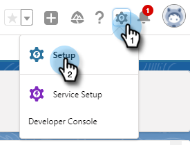
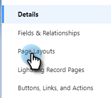
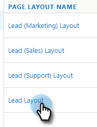
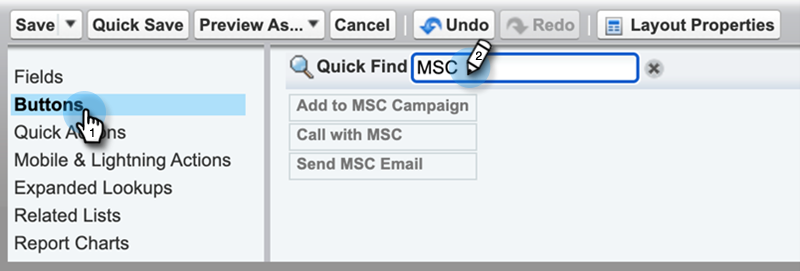
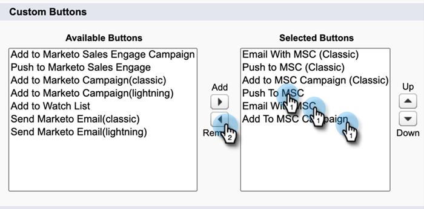
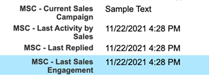

# Marketo Sales Connect verwijderen van Salesforce Lightning {#uninstall-marketo-sales-connect-from-salesforce-lightning}

Hieronder wordt beschreven hoe u het Marketo Sales Connect-pakket verwijdert van uw Salesforce-account wanneer u de Handelingen van Sales Insight gaat gebruiken.

## Verkoop Connect-velden verwijderen uit paginalayout {#remove-sales-connect-fields-from-page-layout}

1. In Salesforce Bliksem, klik het tandwielpictogram en selecteer **Opstelling**.

   

1. Klik **Manager van Objecten**.

   

1. De rol neer aan en selecteert **Lood**.

   

1. Klik **Lay-outs van de Pagina**.

   

1. Klik **Leiding Lay-out**.

   

   >[!NOTE]
   >
   >De lay-outweergave Pagina bewerken is nog niet bijgewerkt in Salesforce Lightning.

1. In de console, uitgezochte **Gebieden**. Zoek in Snel zoeken naar &quot;MSC.&quot; Alle grijze velden zijn toegevoegd aan de pagina-indeling. U moet ze verwijderen.

   

   >[!NOTE]
   >
   >Als geen van de velden grijs wordt weergegeven, hebt u deze niet toegevoegd aan de pagina-indeling. U kunt deze sectie overslaan.

1. Blader naar de sectie met uw aangepaste verkoopvelden voor Connect.

   

1. Er zijn 10 types van gebieden MSC die aan deze sectie kunnen worden toegevoegd. Verwijder alle velden die u hebt toegevoegd of verwijder gewoon de volledige sectie.

1. Klik **Snel sparen** wanneer gedaan.

   

## Knoppen Verkoop verbinden verwijderen uit pagina-indelingen {#remove-sales-connect-buttons-from-page-layouts}

1. In de console (Stap 4 hierboven), uitgezochte **Knopen**. Zoeken naar MSC. Alle grijze knoppen zijn toegevoegd aan de sectie Aangepaste knoppen. U moet ze verwijderen.

   

   >[!NOTE]
   >
   >Als geen van de knoppen grijs wordt weergegeven, betekent dit dat u ze niet hebt toegevoegd. U kunt deze sectie overslaan.

1. Sleep de knopen MSC van de sectie van de Knopen van de Douane aan de console.

   

1. Klik **Snel sparen** wanneer gedaan.

   

## Verkoop Connect-velden verwijderen uit sectie Activiteitenoverzicht {#remove-sales-connect-fields-from-activity-history-section}

1. Blader naar de onderkant van de pagina en klik op het pictogram Sleutel.

   

1. Selecteer de velden Verkoop Connect in het gebied Geselecteerde velden en klik op de pijl Verwijderen. Klik **O.K.** wanneer gedaan.

   

   >[!NOTE]
   >
   >De afkorting MSE _is_ Verkoop verbindt. Het is gewoon de vorige naam, &quot;Marketo Sales Engage&quot;.

1. Klik **sparen** wanneer u met de pagina van Leads wordt gedaan.

## Knoppen Handeling bulksgewijs uit verkoop verwijderen uit de koplijstweergave {#remove-sales-connect-bulk-action-buttons-from-lead-list-view}

1. In Salesforce Bliksem, klik het tandwielpictogram en selecteer **Opstelling**.

   

1. Klik **Manager van Objecten**.

   

1. De rol neer aan en selecteert **Lood**.

   

1. Klik **Lay-outs van het Onderzoek**.

   

1. Klik de pijl naast de Mening van de Lijst en selecteer **uitgeven**.

   

1. Selecteer **toevoegen aan Campagne MSC**, **E-mail met MSC**, en **duw aan MSC**, en klik de Remove pijl. Dan klik **sparen**.

   

De knoppen in de weergave voor de lijst met leads worden niet meer weergegeven.

## MSC-configuratie verwijderen voor contactpersonen {#remove-msc-configuration-for-contacts}

1. In Salesforce Bliksem, klik het tandwielpictogram en selecteer **Opstelling**.

1. Klik **Manager van Objecten**.

1. De rol neer aan en selecteert **Contact**.

1. Klik **Lay-outs van de Pagina**.

1. Klik **Lay-out van het Contact**.

1. Herhaal de stappen van alle drie de secties.

## MSC-configuratie voor opportunity verwijderen {#remove-msc-configuration-for-opportunity}

1. In Salesforce Bliksem, klik het tandwielpictogram en selecteer **Opstelling**.

1. Klik **Manager van Objecten**.

1. De rol neer aan en selecteert **Opportunity**.

1. Klik **Lay-outs van de Pagina**.

1. Klik **Lay-out van de Kanaal**.

De opportuniteitsweergave heeft slechts één knop - &quot;MSE-mail verzenden&quot; en de volgende velden:

## MSC-configuratie voor account verwijderen {#remove-msc-configuration-for-account}

1. In Salesforce Bliksem, klik het tandwielpictogram en selecteer **Opstelling**.

1. Klik **Manager van Objecten**.

1. De rol neer aan en selecteert **Rekening**.

1. Klik **Lay-outs van de Pagina**.

1. Klik **Lay-out van de Rekening**.

De accountweergave heeft slechts één knop - &quot;MSE-mail verzenden&quot; en de volgende velden:

## Postvak UIT Marketo-verkoop verwijderen {#remove-marketo-sales-outbox}

1. Klik in Salesforce op de tab **+** boven in het scherm.

1. Klik **aanpassen Mijn Lusjes**.

1. Selecteer aan de rechterkant de optie Postvak UIT verkopen van Marketo. Klik de Remove pijl, dan klik **sparen**.

## Sales Connect-pakket verwijderen {#delete-sales-connect-package}

Nadat u alle objecten van uw Salesforce-account hebt verwijderd, volgt u de onderstaande stappen.

1. In Salesforce Bliksem, klik het tandwielpictogram en selecteer **Opstelling**.

1. Typ &quot;Apex-klassen&quot; in het vak Snel zoeken.

1. Klik **Schrapping** naast alle &quot;MarketoSalesConnectionCustomization&quot;of &quot;MarketoSalesEngageCustomization&quot;ingangen op uw lijst.

U bent klaar!

Hier volgt een lijst met alle objecten die uit uw Salesforce-exemplaar moeten worden verwijderd:

## Aanpassingsgegevens van Sales Connect {#sales-connect-customization-details}

<table>
 <tr>
  <th>Aangepaste activiteitsvelden</th>
  <th>Beschrijving</th>
  <th>Type</th>
  <th>Gegevenstype</th>
 </tr>
 <tr>
  <td>Lokale Aanwezigheidsidentiteitskaart van de Vraag MSC</td>
  <td>Als gebruiker, kan ik Lokale Aanwezigheid als optie kiezen wanneer ik vraag van Telefoon MSC. De inkomende vraag zal een lokaal aantal voor de ontvanger tonen</td>
  <td>Activiteit</td>
  <td>Tekst</td>
 </tr>
 <tr>
  <td>MSC-URL voor opnamen van oproepen</td>
  <td>De vraag kan worden geregistreerd en een verbinding voor de opname zal hier worden geregistreerd </td>
  <td>Activiteit</td>
  <td>Tekst</td>
 </tr>
 <tr>
  <td>MSC-campagne</td>
  <td>Logs naam van de MSC campagne de contact/lood is op</td>
  <td>Activiteit</td>
  <td>Tekst</td>
 </tr>
 <tr>
  <td>URL voor MSC-campagne</td>
  <td>Logs URL aan de campagne die in MSC werd gecreeerd. Als u hierop klikt, wordt de campagne geopend in de MSC-webtoepassing</td>
  <td>Activiteit</td>
  <td>Tekst</td>
 </tr>
 <tr>
  <td>Huidige stap MSC-campagne</td>
  <td>Als een contact/lood op een campagne is, zal dit gebied de naam van de stap registreren zij momenteel op zijn</td>
  <td>Activiteit</td>
  <td>Selectievakje</td>
 </tr>
 <tr>
  <td>MSC-e-mailbijlage weergegeven</td>
  <td>Hiermee worden gegevens geregistreerd wanneer een e-mailbericht wordt verzonden met een bijlage die door de ontvanger wordt weergegeven</td>
  <td>Activiteit</td>
  <td>Selectievakje</td>
 </tr>
 <tr>
  <td>MSC-e-mail geklikt</td>
  <td>Hiermee wordt een vinkje geregistreerd wanneer de ontvanger op een koppeling in de e-mail klikt</td>
  <td>Activiteit</td>
  <td>Selectievakje</td>
 </tr>
 <tr>
  <td>MSC-e-mail gereageerd</td>
  <td>Logt een vinkje in wanneer de ontvanger op e-mail antwoordt</td>
  <td>Activiteit</td>
  <td>Tekst</td>
 </tr>
 <tr>
  <td>MSC-e-mailstatus</td>
  <td>Geeft aan of een e-mail is verzonden/bezig/teruggestuurd (het bijhouden van teruggestuurde e-mails is afhankelijk van het gebruikte leveringskanaal)</td>
  <td>Activiteit</td>
  <td>Tekst</td>
 </tr>
 <tr>
  <td>MSC-e-mailsjabloon</td>
  <td>Logs naam van het malplaatje MSC dat in e-mail werd gebruikt die naar de lood/de contact wordt verzonden</td>
  <td>Activiteit</td>
  <td>Tekst</td>
 </tr>
 <tr>
  <td>URL MSC-e-mailsjabloon</td>
  <td>Logs URL aan het malplaatje dat in MSC werd gecreeerd. Als u hierop klikt, wordt de sjabloon geopend in de MSC-webtoepassing</td>
  <td>Activiteit</td>
  <td>Tekst</td>
 </tr>
 <tr>
  <td>MSC-e-mailURL</td>
  <td>Als u op deze URL klikt, wordt het opdrachtcentrum in MSC geopend en wordt het tabblad Historie van Personendetails weergegeven, waar de gebruiker de verzonden e-mail kan zien</td>
  <td>Activiteit</td>
  <td>Tekst</td>
 </tr>
 <tr>
  <td>MSC-e-mail weergegeven</td>
  <td>Logt een vinkje in wanneer de ontvanger een e-mail bekijkt</td>
  <td>Activiteit</td>
  <td>Selectievakje</td>
 </tr>
</table>

<table>
 <tr>
  <th>MSC Logboekveld voor oprollen</th>
  <th>Beschrijving</th>
  <th>Type</th>
  <th>Gegevenstype</th>
 </tr>
 <tr>
  <td>MSC - Laatste marketingservice</td>
  <td>Laatste inkomende betrokkenheid van Marketing</td>
  <td>
  
Account
  
Contact
  
Lood
  
Opportunity</td>
  <td>Gegevens en tijd</td>
 </tr>
 <tr>
  <td>MSC - Datum laatste marketingservice</td>
  <td>Tijdstempel voor betrokkenheid bij marketing</td>
  <td>
  
Account
  
Contact
  
Lood
  
Opportunity</td>
  <td>Gegevens en tijd</td>
 </tr>
 <tr>
  <td>MSC - Laatste marketingservice</td>
  <td>Beschrijving van de betrokkenheid</td>
  <td>
  
Account
  
Contact
  
Lood
  
Opportunity</td>
  <td>Tekst</td>
 </tr>
 <tr>
  <td>MSC - Last Marketing Engagement Source</td>
  <td>Source van marketingovereenkomst</td>
  <td>
  
Account
  
Contact
  
Lood
  
Opportunity</td>
  <td>Tekst</td>
 </tr>
 <tr>
  <td>MSC - Last Marketing Engagement Type</td>
  <td>Soort betrokkenheid (bijv. webactiviteit)</td>
  <td>
  
Account
  
Contact
  
Lood
  
Opportunity</td>
  <td>Tekst</td>
 </tr>
 <tr>
  <td>MSC - Laatste activiteit door verkoop</td>
  <td>Laatste uitgaande activiteit uitgevoerd door het verkoopteam</td>
  <td>
  
Account
  
Contact
  
Lood
  
Opportunity</td>
  <td>Gegevens en tijd</td>
 </tr>
 <tr>
  <td>MSC - Laatste reactie</td>
  <td>Laatste e-mailantwoord op e-mail over verkoop</td>
  <td>
  
Account
  
Contact
  
Lood
  
Opportunity</td>
  <td>Gegevens en tijd</td>
 </tr>
 <tr>
  <td>MSC - Huidige verkoopcampagne</td>
  <td>Logs naam van de MSC campagne de contact/lood is op</td>
  <td>
  
Account
  
Contact
  
Lood
  
Opportunity</td>
  <td>Tekst</td>
 </tr>
 <tr>
  <td>MSC - Laatste verkoopservice</td>
  <td>Laatste inkomende betrokkenheid van Sales</td>
  <td>
  
Account
  
Contact
  
Lood
  
Opportunity</td>
  <td>Gegevens en tijd</td>
 </tr>
 <tr>
  <td>MSC - Weigeren</td>
  <td>Veld Weigeren</td>
  <td>
  
Account
  
Contact
  
Lood
  
Opportunity</td>
  <td>Selectievakje</td>
 </tr>
</table>

<table>
 <tr>
  <th>MSC-knoppen</th>
  <th>Beschrijving</th>
  <th>Type</th>
 </tr>
 <tr>
  <td>MSC-e-mail verzenden</td>
  <td>E-mails over verkopen van Salesforce verzenden</td>
  <td>
  
Account
  
Contact
  
Lood
  
Opportunity</td>
 </tr>
 <tr>
  <td>Toevoegen aan MSC-campagne</td>
  <td>Toevoegen aan MSC-campagnes vanuit Salesforce</td>
  <td>
  
Contact
  
Lood</td>
 </tr>
 <tr>
  <td>Naar MSC duwen</td>
  <td>Contactpersoon van Salesforce naar MSC verplaatsen</td>
  <td>
  
Contact
  
Lood</td>
 </tr>
 <tr>
  <td>Vraag met MSC</td>
  <td>Verkoopoproepen vanuit Salesforce uitvoeren</td>
  <td>
  
Contact
  
Lood</td>
 </tr>
</table>

<table>
 <tr>
  <th>MSC Bulk Action Buttons</th>
  <th>Beschrijving</th>
  <th>Type</th>
 </tr>
 <tr>
  <td>Toevoegen aan MSC-campagne</td>
  <td>Toevoegen aan MSC-campagnes vanuit Salesforce</td>
  <td>
  
Contact
  
Lood</td>
 </tr>
 <tr>
  <td>Naar MSC duwen</td>
  <td>Contactpersoon van Salesforce naar MSC verplaatsen</td>
  <td>
  
Contact
  
Lood</td>
 </tr>
 <tr>
  <td>E-mailen met MSC</td>
  <td>E-mailen met MSC van Salesforce</td>
  <td>
  
Contact
  
Lood</td>
 </tr>
</table>
