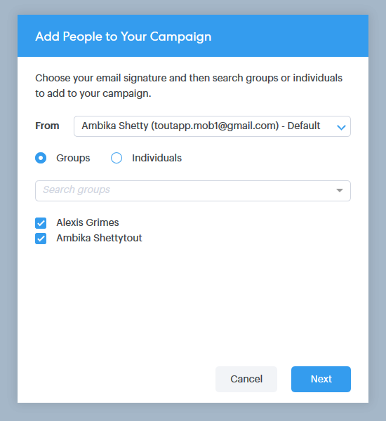

# Bulkhandelingen gebruiken in Salesforce Lightning {#using-bulk-actions-in-salesforce-lightning}

Leer hoe u bulkacties kunt uitvoeren, zoals het toevoegen van leads aan een campagne, het verzenden van een grote hoeveelheid e-mail of het doorsturen van leads van Salesforce naar Sales Connect.

>[!PREREQUISITES]
>
>Update naar de nieuwste versie van het Sales Connect-pakket en installeer de bulkactieknoppen in de weergave voor lead/contact. [Klik hier voor instructies](https://s3.amazonaws.com/tout-user-store/salesforce/assets/SF+Guide+for+Lightning.pdf).

>[!NOTE]
>
>Controleer voordat u de onderstaande stappen uitvoert of u bent aangemeld bij uw Marketo Sales Connect-account.

## E-mailadres {#bulk-email} opheffen

1. Klik in Salesforce op het tabblad **Regelafstand** en kies vervolgens de lijst met gewenste leads.

   

   >[!NOTE]
   >
   >Als u reeds op de lijst bent u zult gebruiken, zult u het opnieuw moeten uitvoeren door het van drop-down te kiezen om de MSC bulkactieknopen te verzekeren verschijnen. Dit is Salesforce-gedrag dat niet kan worden gewijzigd.

1. Klik de pijldrop-down (op uiterst rechts van het scherm) en selecteer **E-mail met MSC**.

   

1. Er verschijnt een MSC-e-mailbericht. Het bevat de volgende functies:

   a. In het veld Aan staat &quot;Alle ontvangstbewijzen&quot;. Dit komt overeen met de lijst met leads die u hebt gekozen in de weergave Lijst met leads\
   b. Deze lijst is zichtbaar in het linkerdeelvenster met de naam &quot;Samenstellen met opsommingstekens&quot;. U kunt hier ontvangers toevoegen of verwijderen\
   c. U kunt een sjabloon kiezen of uw eigen e-mail maken\
   d. U kunt het e-mailbericht meteen verzenden of plannen om het later te verzenden

   

## Toevoegen aan campagne {#add-to-campaign}

1. Klik in Salesforce op het tabblad **Regelafstand** en kies vervolgens de lijst met gewenste leads.

   

1. Klik de pijldrop-down (op uiterst rechts van het scherm) en selecteer **toevoegen aan Campagne MSC**.

   

1. Het pop-upvenster Personen toevoegen aan uw campagne wordt weergegeven. Klik **Volgende** en ga door de typische campagnestroom om een campagne MSC teweeg te brengen.

   

## Druk op Marketo Sales Connect {#push-to-marketo-sales-connect}

1. Klik in Salesforce op het tabblad **Regelafstand** en kies vervolgens de lijst met gewenste leads.

   

1. Klik op de vervolgkeuzelijst met pijlen (uiterst rechts op het scherm) en selecteer **Naar MSC** duwen.

   

1. Er wordt een nieuw tabblad met de naam &quot;Salesforce Bridge&quot; geopend. Klik op de knop **Ga naar groep →**.

   

1. U zult naar uw rekening MSC worden verzonden waar u een groep zult zien die met datum/tijdstempel wordt gecreeerd. U ontvangt een melding als de synchronisatie is voltooid en de groep de leads bevat die zijn gesynchroniseerd via Salesforce.

   

>[!NOTE]
>
>U kunt de zelfde stappen volgen om bulkacties in de Mening van de Lijst van het Contact eveneens te gebruiken.

>[!MORELIKETHIS]
>
>* [E-mailberichten verzenden via e-mail voor groep](/help/marketo/product-docs/marketo-sales-connect/email/using-the-compose-window/sending-emails-via-group-email.md)
>* [Bulke-mails samenstellen met Selecteren en Verzenden](/help/marketo/product-docs/marketo-sales-connect/email/using-the-compose-window/composing-bulk-emails-with-select-and-send.md#sending-emails)

