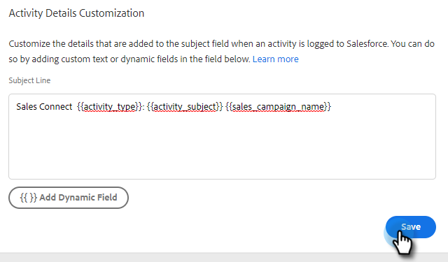

# Aanpassing Salesforce Activity Detail configureren {#configure-salesforce-activity-detail-customization}

>[!PREREQUISITES]
>
>* Salesforce en Marketo Sales Connect [moet zijn aangesloten](/help/marketo/product-docs/marketo-sales-connect/crm/salesforce-integration/connect-your-sales-connect-account-to-salesforce.md)
>* E-mailactiviteit registreren via API [moet worden ingeschakeld](/help/marketo/product-docs/marketo-sales-connect/crm/salesforce-integration/salesforce-sync-settings.md)

Aanpassing van het Detail van de activiteit staat Admins toe om de informatie te vormen die aan het Salesforce Taak - Onderwerp gebied zal registreren, wanneer een de activiteit/herinneringstaak van de Verkoop wordt gesynchroniseerd aan Salesforce.

>[!NOTE]
>
>Updates die in Sales Connect in het onderwerpveld van een herinneringstaak worden aangebracht, worden weergegeven in het onderwerpveld van de overeenkomstige Salesforce-taak als u de optie `{{activity_subject}}` dynamisch veld in de aanpassing van het activiteitsgegeven.

<table>
 <tr>
  <td><strong>1</td>
  <td>Taak InMail-herinnering</td>
 </tr>
 <tr>
  <td><strong>2</td>
  <td>E-mailactiviteit</td>
 </tr>
 <tr>
  <td><strong>3</td>
  <td>Oproepactiviteit</td>
 </tr>
</table>

De functie kan worden gebruikt om de volgende voordelen te ontgrendelen:

* Door aan te passen welke informatie zichtbaar is over het onderwerpveld, zijn de activiteitsdetails gemakkelijk te scannen voor verkoop in Salesforce.
* Beheerders kunnen het onderwerpveld labelen met een unieke id, zoals &quot;Mkto_sales&quot;. Activiteiten van Sales Connect kunnen dus gemakkelijk worden geïdentificeerd en onderscheiden van andere e-mailactiviteiten, callactiviteiten en taken.
* Verminder de behoefte aan de gebieden van de douaneactiviteit. Salesforce past limieten toe op het aantal velden voor aangepaste activiteiten, waardoor kan worden beperkt welke gegevens beschikbaar zijn voor gebruik in rapporten. Als u dynamische velden voor activiteit gebruikt om toetsgegevens toe te voegen aan de onderwerpregel, kunt u het aantal velden voor aangepaste activiteit dat u in uw Salesforce-instantie moet maken, verminderen.
* Het werkgebied en de taken volgen een consistent patroon dat is gedefinieerd door de Sales Connect Admin.

>[!NOTE]
>
>Als u e-mailantwoorden als activiteiten aan Salesforce registreert, zullen zij niet de montages van de Aanpassing van het Detail van de Activiteit Salesforce gebruiken. In plaats daarvan logt u dan af op &quot;Reageren: E-mailonderwerp.&quot;

## Ondersteunde dynamische velden voor activiteiten {#activity-dynamic-fields-supported}

De dynamische de verwijzingsinformatie van Gebieden van de activiteit over uw verkoopactiviteiten om gegevens te bevolken. Vandaag, kunnen zij met de Aanpassing van het Detail van de Activiteit van Salesforce worden gebruikt.

>[!NOTE]
>
>Als er geen waarde is om het dynamische gebied voor een specifieke activiteit/een taak te bevolken, zal het geen gegevens voor dat dynamische gebied bevolken wanneer Salesforce Taak - Onderwerp Gebied wordt bijgewerkt.

<table>
 <tr>
  <th>Veld</th>
  <th>Beschrijving</th>
 </tr>
 <tr>
  <td>{{activity_type}</td>
  <td>Hiermee vult u het taaktype in als E-mail, Bel, InMail of Aangepast.</td>
 </tr>
 <tr>
  <td>{{activity_subject}</td>
  <td>
Zal het onderwerp van de taak vullen.

      
In het geval van een e-mail wordt de onderwerpregel van de e-mail ingevuld.

      
In het geval van vraag, inMail, of douane, zal het een waarde bevolken als er een herinneringstaak was die met een waarde op het de taaknaam/onderwerpgebied werd gecreeerd.
</td>
 </tr>
 <tr>
  <td>{{sales_campagne_name}}</td>
  <td>Als de activiteit van een verkoopcampagne werd geïnitieerd, zal het de naam van de verkoopcampagne bevolken.</td>
 </tr>
 <tr>
  <td>{{sales_campaign_day}}</td>
  <td>Als de activiteit van een verkoopcampagne werd geïnitieerd, zal het het aantal van de de verkoopcampagne dag van deze activiteit bevolken op.</td>
 </tr>
 <tr>
  <td>{{sales_campaign_step}}</td>
  <td>Als de activiteit van een verkoopcampagne werd geïnitieerd, zal het het stapaantal binnen de dag van de verkoopcampagne bevolken deze activiteit op voorkwam.</td>
 </tr>
 <tr>
  <td>{call_result}</td>
  <td>Als de activiteit een vraag is en een vraagresultaat wordt geselecteerd, zal dit de waarde van het vraagresultaat bevolken.</td>
 </tr>
 <tr>
  <td>{{call_reason}}</td>
  <td>Als de activiteit een vraag is en een vraagreden wordt geselecteerd, zal dit de waarde van de vraagreden bevolken.</td>
 </tr>
</table>

## Aanpassing Salesforce Activity Detail configureren {#configuring-salesforce-activity-detail-customization}

>[!NOTE]
>
>**Beheerdersmachtigingen vereist.**

Wanneer het vormen van uw activiteitendetails, overweeg welke gegevens voor verkoop het meest relevant zouden zijn wanneer het herzien van taakgeschiedenis in Salesforce.

1. Klik op het tandwielpictogram en selecteer **Instellingen**.

   

1. Klikken **Salesforce**.

   

1. Klikken **Instellingen synchroniseren**.

   

1. Voeg in de redacteur van de Aanpassing van de Details van de Activiteit om het even welke vrije tekst toe u wilt. De tekst die u toevoegt, is niet dynamisch en blijft ongewijzigd voor het onderwerpveld van alle taken die zijn gesynchroniseerd met Salesforce.

   

   >[!TIP]
   >
   >Hoewel niet vereist, kan het voor sommige mensen gemakkelijker worden om toegevoegde tekst tussen de gegevens te merken wanneer het aan een onderwerpgebied in Salesforce wordt bevolkt. Voorbeeld: `[Sales Connect] - {{Activity_type}}`

1. Voeg aanvullende dynamische velden toe die u wilt toevoegen door op de knop **Dynamisch veld toevoegen** knop.

   

1. Selecteer de gewenste dynamische velden.

   

1. Klikken **Opslaan**.

   

>[!NOTE]
>
>Salesforce past een limiet van 255 tekens toe. Als uw activiteitendetail dat overschrijdt, zal het worden beknot om de informatie te verzekeren op het Salesforce onderwerpgebied wordt opgeslagen.

>[!MORELIKETHIS]
>
>* [Instellingen synchroniseren](/help/marketo/product-docs/marketo-sales-connect/crm/salesforce-integration/salesforce-sync-settings.md)
>* [Herinnering taaksynchronisatie met Salesforce](/help/marketo/product-docs/marketo-sales-connect/tasks/reminder-task-sync-with-salesforce.md)
>* [Aanpassing van Sales Connect voor CRM](/help/marketo/product-docs/marketo-sales-connect/crm/salesforce-customization/sales-connect-customizations-for-crm.md)

