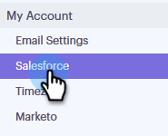
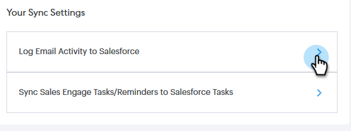

# Salesforce-instellingen synchroniseren {#salesforce-sync-settings}

## E-mailactiviteiten aanmelden bij Salesforce via API {#logging-email-activity-to-salesforce-via-api}

Voor deze functionaliteit moet u zich op de Enterprise/Unlimited Edition van Salesforce bevinden, of de Professional Edition als u Integratie via de Web Services API hebt aangeschaft.

>[!PREREQUISITES]
>
>Salesforce en Sales Connect moeten verbonden zijn.

1. Klik in [!DNL Sales Connect] op het tandwielpictogram rechtsboven en selecteer **[!UICONTROL Settings]** .

   

1. Klik onder [!UICONTROL My Account] ([!UICONTROL Admin Settings] als u een beheerder bent) op **[!UICONTROL Salesforce]** .

   

1. Klik op de tab **[!UICONTROL Sync Settings]** .

   

1. Klik op de pijl naast E-mailactiviteiten in log [!DNL Salesforce] .

   

1. Klik op de tab **[!UICONTROL Salesforce API]** . Op deze kaart kunt u uw voorkeur voor het registreren van informatie aan [!DNL Salesforce] plaatsen. Klik op **[!UICONTROL Save]** als u klaar bent.

   

## E-mailactiviteit bij Salesforce aanmelden via e-mail naar Salesforce (BCC) {#logging-email-activity-to-salesforce-via-email-to-salesforce-bcc}

Nadat je &quot;E-mail naar Salesforce (BCC)&quot; hebt geactiveerd, ontvang je een BCC van je e-mails over verkopen en worden je e-mails geregistreerd als activiteiten op het gebied van kansen, leads en contactpersonen.

>[!PREREQUISITES]
>
>[!DNL Salesforce] en [!DNL Sales Connect] moeten zijn verbonden.

**om uw e-mails in Salesforce via E-mail (BCC) te registreren**

1. Klik in [!UICONTROL Sales Connect] op het tandwielpictogram rechtsboven en selecteer **[!UICONTROL Settings]** .

   

1. Klik onder [!UICONTROL My Account] ([!UICONTROL Admin Settings] als u een beheerder bent) op **[!UICONTROL Salesforce]** .

   

1. Klik op de tab **[!UICONTROL Sync Settings]** .

   

1. Klik op de tab **[!UICONTROL Email to Salesforce (BCC)]** en klik op **[!UICONTROL Activate]** .

   

Als uw e-mailadres om een of andere reden niet wordt aangemeld, voert u de volgende stappen uit om de functie BCC in uw [!DNL Salesforce] -account te activeren:[!DNL Salesforce]

1. Meld u aan bij uw [!DNL Salesforce] -instantie.
1. Zoek de gebruikersnaam in de rechterbovenhoek en selecteer de vervolgkeuzelijst.
1. Selecteer **[!UICONTROL My Settings]**.
1. Selecteer **[!UICONTROL Email]**.
1. Selecteer **[!UICONTROL My Email to Salesforce]**.
1. Op deze pagina wordt het veld E-mail naar Salesforce-adres weergegeven. Als er niets naast het is bevolkt, scrol neer aan &quot;Mijn Acceptabele E-mailadressen.&quot;
1. Voer het e-mailadres of de e-mailadressen in die u voor BCC wilt gebruiken.
1. Klik op **[!UICONTROL Save Changes]**.

**kan Mijn e-mail aan [!DNL Salesforce] in Mijn Montages niet vinden**

Als Mijn e-mail naar Salesforce niet wordt weergegeven onder de instellingen, is het mogelijk dat uw beheerder deze functie niet heeft ingeschakeld. Dit kan gebeuren als uw team nieuw is voor [!DNL Salesforce] of als uw team het BCC-adres dat [!DNL Salesforce] verschaft, nooit heeft gebruikt.

>[!NOTE]
>
>U hebt beheerdersrechten nodig om dit in te stellen.

1. Klik op **[!UICONTROL Setup]**.
1. Klik op **[!UICONTROL Email Administration]**.
1. Klik op **[!UICONTROL Email to Salesforce]**.
1. Klik op **[!UICONTROL Edit]**.
1. Schakel het vakje naast &quot;[!UICONTROL Active]&quot; in.
1. Klik op **[!UICONTROL Save]**.

## Verkoop Connect-taken/herinneringen synchroniseren met [!DNL Salesforce] taken {#sync-sales-connect-tasks-reminders-to-salesforce-tasks}

1. Klik op het tandwielpictogram rechtsboven en selecteer **[!UICONTROL Settings]** .

   

1. Klik onder [!UICONTROL My Account] ([!UICONTROL Admin Settings] als u een beheerder bent) op **[!UICONTROL Salesforce]** .

   

1. Klik op de tab **[!UICONTROL Sync Settings]** .

   

1. Klik op de pijl naast [!UICONTROL Sync Sales Engage Tasks/Reminders to Salesforce Tasks] .

   

1. Kies de gewenste optie (&quot;[!UICONTROL Do not sync to Salesforce tasks]&quot;wordt geselecteerd door gebrek).

   
