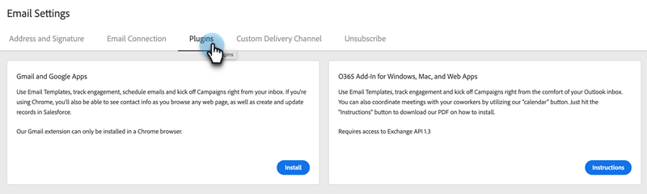

# De insteekmodule Sales Connect Email voor Gmail installeren {#install-the-sales-connect-email-plugin-for-gmail}

Leer hoe u de Gmail-plug-in installeert.

>[!IMPORTANT]
>
>De e-mailplug-ins voor Gmail en Outlook worden alleen ondersteund voor Marketo Sales Connect-gebruikers. Zij worden **niet** gesteund voor de gebruikers van de Acties van het Inzicht van de Verkoop.

1. In de [ Webtoepassing ](https://toutapp.com/next#settings), klik het tandwielpictogram en klik **[!UICONTROL Settings]**.

   

1. Klik onder Mijn account op **[!UICONTROL Email Settings]** .

   

1. Klik op de tab **[!UICONTROL Plugins]** .

   

1. Klik onder Gmail- en Google-toepassingen op **[!UICONTROL Install]** .

   
