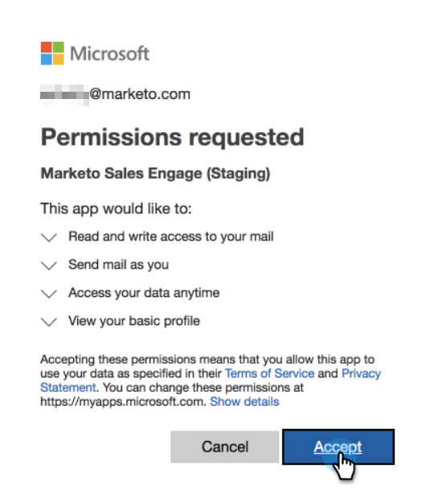

# E-mailverbinding voor [!DNL Outlook] gebruikers {#email-connection-for-outlook-users}

Leer hoe u uw [!DNL Sales Connect] -account kunt verbinden met [!DNL Outlook] .

>[!NOTE]
>
>Elke gebruiker moet verbinding maken met [!DNL Outlook] vanuit zijn [!DNL Sales Connect] -account.

## Verbinding maken met [!DNL Outlook] Online {#connecting-to-outlook-online}

Als u verbinding maakt met [!DNL Outlook], ontvangt u tracering van antwoorden, toegang tot het [!DNL Outlook] leveringskanaal, de mogelijkheid om e-mails te plannen in [!DNL Outlook] en de compatibiliteit te verzenden.

1. Klik in [!DNL Sales Connect] op het tandwielpictogram en selecteer **[!UICONTROL Settings]** .

   

1. Selecteer onder Mijn account de optie **[!UICONTROL Email Settings]** .

   

1. Klik op de tab **[!UICONTROL Email Connection]** .

   

1. Klik op **[!UICONTROL Get Started]**.

   

1. Selecteer **[!UICONTROL I use Outlook to send emails]** en klik op **[!UICONTROL Next]** .

   

1. Selecteer de versie van [!DNL Outlook] die u gebruikt en klik op **[!UICONTROL Next]** . In dit voorbeeld kiezen we [!DNL Outlook Online] .

   

   <table>
    <tbody>
     <tr>
      <td><strong>[!DNL Outlook Online]</strong></td>
      <td>Ook bekend als [!DNL Exchange Online]</td>
     </tr>
     <tr>
      <td><strong>[!DNL Exchange On-premise]</strong></td>
      <td>Omvat [!DNL Exchange] 2013 en 2016</td>
     </tr>
    </tbody>
   </table>

   >[!NOTE]
   >
   >Marketo biedt momenteel geen ondersteuning voor [!DNL Exchange Hybrid] -accounts.

1. Klik op **[!UICONTROL OK]**.

   

1. Als u niet bent aangemeld bij [!DNL Outlook] , voert u uw aanmeldingsgegevens in en klikt u op **[!UICONTROL Next]** . Kies in dat geval de account waarmee u verbinding wilt maken en klik op **[!UICONTROL Next]** . In dit voorbeeld zijn we al aangemeld.

   

1. Klik op **[!UICONTROL Accept]**.

   

   U kunt deze verbinding gebruiken om e-mailberichten en ook als leveringskanaal bij te houden.

   >[!NOTE]
   >
   >[!DNL Outlook Online (Office365)] handhaaft zijn eigen verzendingsgrenzen. [ leer hier meer ](/help/marketo/product-docs/marketo-sales-connect/email/email-delivery/email-connection-throttling.md#email-provider-limits).

## Verbinding maken met [!DNL Exchange On-Premise] {#connecting-to-exchange-on-premise}

Als u verbinding maakt met [!DNL Exchange On-Premise], ontvangt u tracering van antwoorden, toegang tot het [!DNL Outlook] leveringskanaal, de mogelijkheid om e-mails te plannen in [!DNL Outlook] en de compatibiliteit te verzenden.

1. Klik in [!DNL Sales Connect] op het tandwielpictogram en selecteer **[!UICONTROL Settings]** .

   

1. Selecteer onder [!UICONTROL My Account] de optie **[!UICONTROL Email Settings]** .

   

1. Klik op de tab **[!UICONTROL Email Connection]** .

   

1. Klik op **[!UICONTROL Get Started]**.

   

1. Selecteer **[!UICONTROL I use Outlook to send emails]** en klik op **[!UICONTROL Next]** .

   

1. Selecteer de versie van [!DNL Outlook] die u gebruikt en klik op **[!UICONTROL Next]** . In dit voorbeeld kiezen we [!DNL Exchange On-premise] .

   

   <table>
    <tbody>
     <tr>
      <td><strong>[!DNL Outlook Online]</strong></td>
      <td>Ook bekend als [!DNL Exchange Online]</td>
     </tr>
     <tr>
      <td><strong>[!DNL Exchange On-premise]</strong></td>
      <td>Omvat [!DNL Exchange] 2013 en 2016</td>
     </tr>
    </tbody>
   </table>

1. Voer uw referenties in en klik op **[!UICONTROL Connect]** .

   

   >[!NOTE]
   >
   >Als u Automatisch detecteren uitschakelt in de vervolgkeuzelijst Versie van [!DNL Exchange] , moet u de [!DNL Exchange] URL aan uw IT-afdeling vragen.

   U kunt deze verbinding gebruiken om e-mailberichten en ook als leveringskanaal bij te houden.

   >[!NOTE]
   >
   >Wanneer u [!DNL Exchange On-prem] gebruikt, stelt uw IT-team uw limiet voor het verzenden van e-mail vast.
