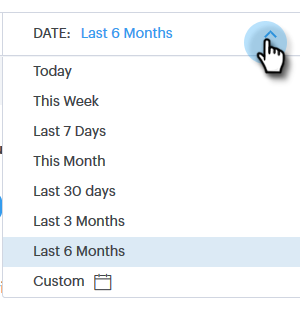

# Overzicht van geavanceerd zoeken {#advanced-search-overview}

Door de geavanceerde zoekopdracht te gebruiken voor het zoeken naar vooruitzichten die e-mails hebben weergegeven, erop hebben geklikt of erop hebben gereageerd, kunt u een gerichte lijst met uw meest betrokken vooruitzichten maken.

## Toegang tot geavanceerde zoekfunctie {#how-to-access-advanced-search}

1. Klik op **[!UICONTROL Command Center]**.

   

1. Klik op **[!UICONTROL Emails]**.

   

1. Kies het toepasselijke tabblad.

   

1. Klik op **[!UICONTROL Advanced Search]**.

   

## Filters {#filters}

**Datum**

Kies het datumbereik voor uw zoekopdracht. Datums met voorinstellingen worden bijgewerkt afhankelijk van de e-mailstatus die u kiest ([!UICONTROL Sent], [!UICONTROL Undelivered], [!UICONTROL Pending] ).

**Who**

Filter op e-mailontvanger/afzender in de sectie [!UICONTROL Who] .

| Vervolgkeuzelijst | Beschrijving |
|---|---|
| **[!UICONTROL View As]** | Filter door een specifieke afzender in uw [!DNL Sales Connect] -instantie (deze optie is alleen beschikbaar voor Admins). |
| **[!UICONTROL By Group]** | E-mailberichten filteren op een specifieke groep ontvangers. |
| **[!UICONTROL By Person]** | Filteren op een specifieke ontvanger. |

**wanneer**

Kies op gemaakte datum, geleverde datum, mislukte datum of geplande datum. Welke opties beschikbaar zijn, is afhankelijk van de e-mailstatus die u kiest ( [!UICONTROL Sent], [!UICONTROL Undelivered], [!UICONTROL Pending] ).

**Campagnes**

E-mailberichten filteren op deelname aan de campagne.

**Status**

Er zijn drie e-mailstatussen waaruit u kunt kiezen. De type-/activiteitopties veranderen op basis van de geselecteerde status.

***Status: Verzonden***

Filters op basis van de verzonden e-mailactiviteit. U kunt weergaven/geen weergaven kiezen, klikken/geen klikken, en/of antwoorden/geen antwoorden.

***Status: In afwachting van***

Filtert op alle e-mails die in behandeling zijn.

| Status | Beschrijving |
|---|---|
| **[!UICONTROL Scheduled]** | E-mails die van het samenstellings venster ([!DNL Salesforce] of Web App), e-mailstop-ins, of een campagne zijn gepland. |
| **[!UICONTROL Drafts]** | E-mails die zich momenteel in de conceptstatus bevinden. E-mails vereisen een onderwerpregel en een ontvanger om als concept te worden opgeslagen. |
| **[!UICONTROL In Progress]** | E-mails die worden verzonden. E-mails mogen niet langer dan een paar seconden in deze status blijven. |

***Status: Niet bezorgd***

Filters op e-mails die nooit zijn bezorgd.

| Status | Beschrijving |
|---|---|
| **[!UICONTROL Failed]** | Wanneer een e-mailbericht niet wordt verzonden vanuit [!DNL Sales Connect] (algemene redenen zijn onder andere: e-mails die worden verzonden naar contactpersonen waarvoor geen abonnement is genomen of geblokkeerde contactpersonen, of als er een probleem is opgetreden met het vullen van dynamische velden). |
| **[!UICONTROL Bounced]** | Een e-mailbericht wordt gemarkeerd als teruggestuurd wanneer het wordt afgewezen door de server van de ontvanger. Hier worden alleen e-mails weergegeven die via [!DNL Sales Connect] -servers zijn verzonden. |
| **[!UICONTROL Spam]** | Wanneer het e-mailbericht door de ontvanger is gemarkeerd als spam (algemene term voor ongevraagde e-mail). Hier worden alleen e-mails weergegeven die via [!DNL Sales Connect] -servers zijn verzonden. |

## Opgeslagen zoekopdrachten {#saved-searches}

Hieronder wordt beschreven hoe u een opgeslagen zoekopdracht maakt.

1. Klik op **[!UICONTROL Save Filters As]** nadat alle filters zijn geïnstalleerd.

   

1. Geef de zoekopdracht een naam en klik op **[!UICONTROL Save]** .

   

   De opgeslagen zoekopdrachten staan op de zijbalk links.

   
