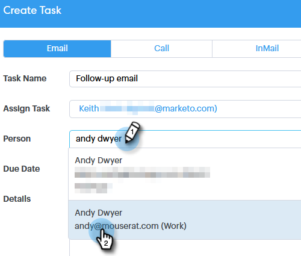

# Taken toewijzen aan teamleden {#assigning-tasks-to-team-members}

Als u met andere teamleden wilt samenwerken, kan het toewijzen van taken een grote manier zijn om uw prospectieve inspanningen te coördineren.

>[!NOTE]
>
>U kunt alleen taken toewijzen voor gedeelde contactpersonen.

1. Klik op **[!UICONTROL Command Center]**.

   

1. Klik op **[!UICONTROL Add Task]**.

   

1. Selecteer het taaktype.

   

1. Geef uw taak een naam.

   

1. Selecteer de persoon in uw team waaraan u de taak wilt toewijzen in het veld **[!UICONTROL Assign Task]** .

   

1. Voeg de persoon toe u uit wilt bereiken op het persoongebied.

   

1. Selecteer de **[!UICONTROL Due Date]** .

   

1. Stel de **[!UICONTROL Priority]** in.

   

1. Voeg alle belangrijke gegevens toe die relevant zijn voor uw teamgenoot (optioneel) en klik op **[!UICONTROL Create]** .

   
