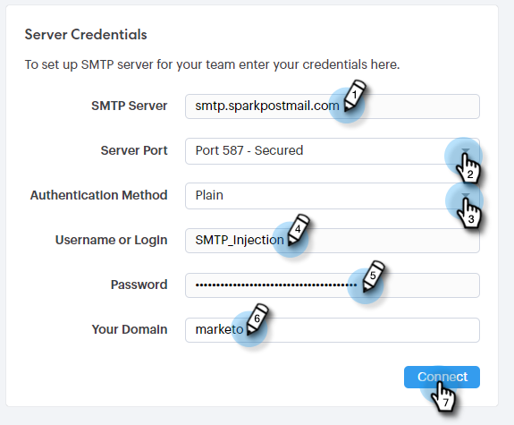

# Een aangepast leveringskanaal instellen {#setting-up-a-custom-delivery-channel}

Met [!DNL Marketo Sales Connect] kunt u integreren met een aangepaste SMTP-server voor de levering van uw e-mails. Dit is een goede optie voor diegenen die geen grote e-mailberichten uit hun Gmail of [!DNL Exchange] leveringskanaal willen verzenden.

De gebruikers kunnen opstelling een douaneSMTP server voor hun eigen individueel gebruik, of Admins kunnen opstelling een Team SMTP dat over alle [!DNL Sales Connect] gebruikers in uw instantie moet worden gedeeld.

>[!NOTE]
>
>* Naast vestiging uw server SMTP, moet uw [ e-mailidentiteit worden geverifieerd ](/help/marketo/product-docs/marketo-sales-connect/getting-started/email-settings/verify-your-email.md) alvorens u e-mails kunt verzenden.
>* Wij adviseren werkend met uw team van IT of SMTP serververkoper om de juiste servergeloofsbrieven voor uw server te krijgen SMTP.
>* U kunt uw Gmail en [!DNL Exchange] server niet verbinden gebruikend de SMTP servergeloofsbrieven. Gebruik onze E-mailverbindingsservice om deze providers te integreren.

## Aangepaste SMTP {#custom-smtp}

1. Login aan de [ Webtoepassing ](https://toutapp.com/login), klik het tandwielpictogram op het hoogste recht en kies **[!UICONTROL Settings]**.

   

1. Klik onder [!UICONTROL My Account] op **[!UICONTROL Email Settings]** .

   

1. Klik op **[!UICONTROL Custom Delivery Channel]**.

   

1. Voer uw [!UICONTROL SMTP Server] -gegevens in en klik op **[!UICONTROL Connect]** .

   

   >[!NOTE]
   >
   >Als dit uw enige leveringskanaal is, wordt het automatisch toegewezen aan al uw e-mailidentiteiten, en u wordt hier gedaan. Als dit niet uw enige leveringskanaal is, gelieve te blijven aan Stap 5.

1. Klik terwijl u zich nog in [!UICONTROL Email Settings] bevindt op **[!UICONTROL Address and Signature]** .

   

1. Zoek de e-mailidentiteit waarvoor u een leveringskanaal wilt kiezen en klik op **[!UICONTROL Choose Delivery Channel]** .

   

1. Klik in de [!UICONTROL Deliverability] -kaart op **[!UICONTROL Edit]** .

   

1. Klik op de vervolgkeuzelijst [!UICONTROL Channel] en kies het aangepaste leveringskanaal dat u zojuist hebt toegevoegd. Klik op **[!UICONTROL Save]**.

   

   >[!NOTE]
   >
   >Als uw teambeheerder omhoog de Server van het Team SMTP plaatst, zal het automatisch slechts op uw standaard e-mailidentiteit van toepassing zijn, en beschikbaar als optie voor uw andere e-mailidentiteiten.

## Team SMTP-server {#team-smtp-server}

>[!NOTE]
>
>**Vereiste Bevoegdheden Admin**

1. Login aan de [ Webtoepassing ](https://toutapp.com/login), klik het tandwielpictogram op het hoogste recht en kies **[!UICONTROL Settings]**.

   

1. Klik onder [!UICONTROL Admin Settings] op **[!UICONTROL General]** .

   

1. Klik op **[!UICONTROL Team Delivery Channel]**.

   

1. Voer uw [!UICONTROL SMTP Server] -gegevens in en klik op **[!UICONTROL Connect]** .

   

   >[!NOTE]
   >
   >De server van Team SMTP zal het standaardleveringskanaal van de standaard e-mailidentiteit voor alle teamleden zijn. Bovendien is deze beschikbaar als optie voor het leveringskanaal voor alle andere e-mailidentiteiten.

   >[!MORELIKETHIS]
   >
   >* [ E-mailVerbinding voor de Gebruikers van Gmail ](/help/marketo/product-docs/marketo-sales-connect/email-plugins/gmail/email-connection-for-gmail-users.md)
   >
   >* [ E-mailVerbinding voor  [!DNL Outlook]  Gebruikers ](/help/marketo/product-docs/marketo-sales-connect/email-plugins/msc-for-outlook/email-connection-for-outlook-users.md)
