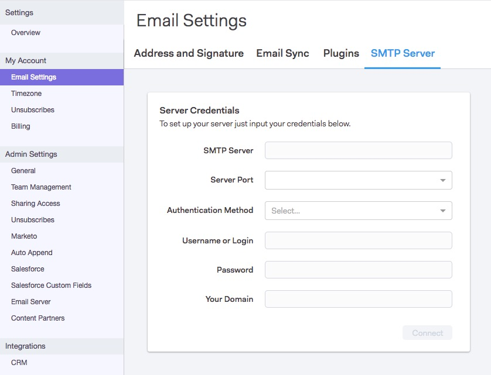

# Een SMTP-server {#setting-up-an-smtp-server} instellen

## Overzicht {#overview}

**Wat is een server SMTP?**

**** Eenvoudig  **** Protocol van de  ****  **** Overdracht van de Post, is dit de server verantwoordelijk voor het verzenden van uw uitgaande post. Wanneer u een e-mailbericht verzendt van uw e-mailclient, gebruikt u dezelfde service om uw e-mailbericht te verzenden.

**Waarom wil ik mijn SMTP-server instellen met Sales Connect?**

Het staat u toe om de reputatie van het domein en de leverbaarheid van uw bedrijf te gebruiken, en niet op anderen te hoeven vertrouwen&quot;. Onze standaardMSC Servers maken deel uit van een gedeelde IP pool, wat het verzenden van een gedeelde reputatie betekent. We raden uw team ten zeerste aan om hun eigen leveringskanaal in te stellen met Sales Connect.

**Hoe verzendt Sales Connect met mijn SMTP-server?**

Door [deze stappen](https://docs.marketo.com/x/ZgPh) te volgen.

`<pre><em>SMTP Server Setup Page in Sales Connect</em>  </pre>` **Moet ik iets instellen in mijn e-mailclient?**

Wat een leveringskanaal betreft, nee. Nadat u de add-in hebt geïnstalleerd, gebruikt Sales Connect hetzelfde leveringskanaal als u hebt ingesteld voor het verzenden van e-mails.

## De SMTP-referenties ophalen {#getting-the-smtp-credentials}

**Hoe krijg ik mijn geloofsbrieven SMTP?**

Neem contact op met uw IT-team om na te gaan welk leveringskanaal uw bedrijf gebruikt om e-mails te verzenden en hoe u toegang krijgt tot uw SMTP-referenties. Afhankelijk van hoe uw server wordt gevormd, kunt u sommige douanewaarden voor de Naam van de Server SMTP of de Haven van de Server hebben. Neem contact op met uw e-mailprovider als u geen toegewezen IT-team hebt.

**Wat zijn mijn opties als mijn bedrijf Office365 gebruikt?**

Pros

* Eenvoudig in te stellen
* Om het even welke gebruiker met een rekening Office365 zal toegang tot deze server SMTP hebben

Cons

* Throtting kan optreden
* Elke gebruiker moet dit zelf instellen
* Het wijzigen van het O365-wachtwoord van een gebruiker leidt tot een verbroken verbinding

Als u Office365 of Uitwisseling Online gebruikt, kunt u met uw server verbinden SMTP gebruikend een standaardreeks geloofsbrieven. Houd er rekening mee dat Office365 geen service voor het leveren van grote hoeveelheden e-mail is, hoewel dit goed werkt bij het verzenden van eenmalige e-mails. Bij het verzenden van grote e-mailberichten kan Office365 uw e-mails vertragen, wat tot mislukte bezorging kan leiden. Meer over deze controle uit het artikel van Microsoft op [hoe te opstelling SMTP cliëntvoorlegging](https://support.office.com/en-us/article/how-to-set-up-a-multifunction-device-or-application-to-send-email-using-office-365-69f58e99-c550-4274-ad18-c805d654b4c4).

&quot;U kunt slechts van één e-mailadres verzenden tenzij uw apparaat login geloofsbrieven voor veelvoudige Office 365 brievenbussen kan opslaan. Office 365 legt een grens van 30 berichten per minuut, en een grens van 10.000 ontvangers per dag op.&quot;

Als u besluit om Office365 als uw leveringskanaal te gebruiken, zult u deze geloofsbrieven moeten ingaan. De zelfde geloofsbrieven kunnen niet over het team worden gebruikt omdat Office365 e-mail en het wachtwoord van de gebruiker gebruikt om verbinding te maken.

Microsoft en bulksgewijs verzenden

[Klik ](https://technet.microsoft.com/en-us/library/exchange-online-limits.aspx#RecipientLimits) hier voor meer informatie over bulkverzending in Office365.

De Online klanten van de uitwisseling die legitieme bulkcommerciële e-mail (bijvoorbeeld, klantennieuwsbrieven) moeten verzenden zouden derdeleveranciers moeten gebruiken die in deze diensten specialiseren.&quot;

**Wat als mijn bedrijf Gmail gebruikt?**

U hoeft geen SMTP-referenties op te halen als uw team Gmail wilt gebruiken als leveringskanaal met Sales Connect. Met Sales Connect kunnen gebruikers via onze OAuth-integratie toegang krijgen tot hun Gmail-leveringskanaal. Gebruikers kunnen dit inschakelen door hun Sales Connect-account te integreren met Gmail.

**Kan ik de zelfde geloofsbrieven SMTP met mijn volledige team delen?**

Dit hangt van het leveringskanaal af u gebruikt. De diensten zoals Sparkpost staan de geloofsbrieven toe om op domein-gebaseerd te zijn, zodat wordt iedereen die met een specifiek domein verzendt voor authentiek verklaard om door die server te verzenden. Als dit het geval is, dan ja, kunt u de geloofsbrieven met het team delen.

Als u verbinding maakt met Office365, zijn de gegevens gebaseerd op e-mailadressen. Dit betekent dat alleen het e-mailadres waarmee de verbinding tot stand is gebracht, wordt geverifieerd voor het verzenden van e-mails via dat leveringskanaal. De referenties moeten daarom **niet** worden gedeeld.

