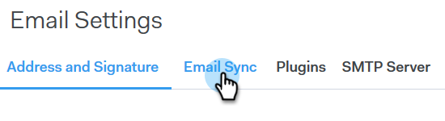

# Uw leveringskanaal instellen {#setting-up-your-delivery-channel}

Wanneer u Marketo Sales Connect gaat gebruiken, moet u een SMTP-server instellen om e-mailberichten te verzenden.

>[!NOTE]
>
>Naast het opzetten van uw SMTP-server, moet uw [e-mailidentiteit worden geverifieerd](/help/marketo/product-docs/marketo-sales-connect/getting-started/email-settings/verify-your-email.md) voordat u e-mailberichten kunt verzenden.

U kunt verkiezen om e-mails te verzenden gebruikend een Server van de Douane SMTP, een Server van het Team SMTP, of Gmail als leveringskanaal. Laten we elke optie overslaan.

## Aangepaste SMTP {#custom-smtp}

1. Meld u aan bij de [webtoepassing](https://toutapp.com/login), klik op het tandwielpictogram rechtsboven en kies **Instellingen**.

   

1. Klik onder Mijn account op **E-mailinstellingen**.

   

1. Selecteer **SMTP Server**.

   

1. Voer uw SMTP-serverreferenties in en klik op **Connect**.

   

   >[!NOTE]
   >
   >Als dit uw enige leveringskanaal is, wordt het automatisch toegewezen aan al uw e-mailidentiteiten, en u wordt hier gedaan. Als dit niet uw enige leveringskanaal is, gelieve te blijven aan Stap 5.

1. Terwijl nog in E-mailmontages, klik **Adres en Handtekening**.

   

1. Zoek de e-mailidentiteit waarvoor u een leveringskanaal wilt kiezen en klik **Kies Leveringskanaal**.

   

1. Klik in de afleveringskaart op **Bewerken**.

   

1. Klik op de vervolgkeuzelijst Kanaal en kies het aangepaste leveringskanaal dat u zojuist hebt toegevoegd. Klik **Opslaan**.

   

   >[!NOTE]
   >
   >Als uw teambeheerder omhoog de Server van het Team SMTP plaatst, zal het automatisch slechts op uw standaard e-mailidentiteit van toepassing zijn, en beschikbaar als optie voor uw andere e-mailidentiteiten.

## Team SMTP-server {#team-smtp-server}

>[!NOTE]
>
>**Beheerdersmachtigingen vereist**

1. Meld u aan bij de [webtoepassing](https://toutapp.com/login), klik op het tandwielpictogram rechtsboven en kies **Instellingen**.

   

1. Klik onder Beheerinstellingen op **Team SMTP-server**.

   

1. Voer uw SMTP-serverreferenties in en klik op **Connect**.

   

   >[!NOTE]
   >
   >De server van Team SMTP zal het standaardleveringskanaal van de standaard e-mailidentiteit voor alle teamleden zijn. Bovendien is deze beschikbaar als optie voor het leveringskanaal voor alle andere e-mailidentiteiten.

## Gmail {#gmail}

1. Meld u aan bij de [webtoepassing](https://toutapp.com/login), klik op het tandwielpictogram rechtsboven en kies **Instellingen**.

   

1. Klik onder Mijn account op **E-mailinstellingen**.

   

1. Klik **E-mailsynchronisatie**.

   

1. Klik **Verbind met Google**.

   

1. Meld u aan met uw Google-referenties.

1. Wanneer u aan dit scherm krijgt, klik **Toestaan**.

   

   >[!NOTE]
   >
   >Als dit uw enige leveringskanaal is, wordt het automatisch toegewezen aan al uw e-mailidentiteiten, en u wordt hier gedaan. Ga naar stap 7 als Gmail niet uw enige leveringskanaal is.

1. Klik **Adres en handtekening**.

   

1. Klik op de e-mailidentiteit waarvoor u Gmail als leveringskanaal wilt gebruiken.

   

1. Schuif omlaag naar de opnamekaart wanneer het venster wordt geopend.

   

1. Klik op de vervolgkeuzelijst Kanaal en kies het Gmail-leveringskanaal dat u zojuist hebt toegevoegd. Klik **Opslaan**.

   

   >[!NOTE]
   >
   >Als uw teambeheerder omhoog de Server van het Team SMTP plaatst, zal het automatisch slechts op uw standaard e-mailidentiteit van toepassing zijn, en beschikbaar als optie voor uw andere e-mailidentiteiten.
