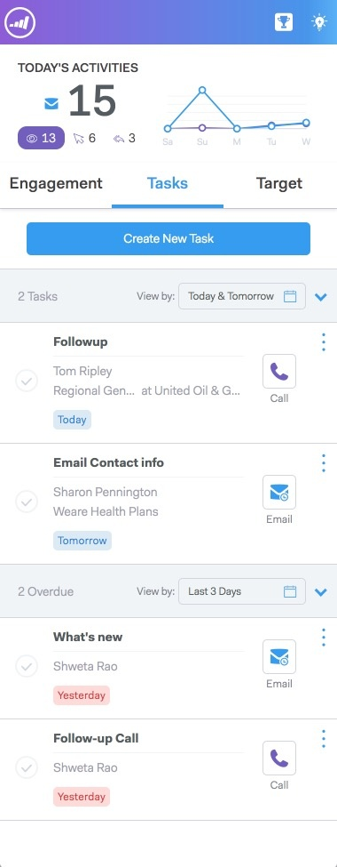

# Overzicht van Live feed {#live-feed-overview}

Live Feed is een zwevend venster dat kan worden gestart vanuit de webtoepassing of de Gmail-plug-in en biedt een realtime kijk op de betrokkenheid bij het vooruitzicht.

## Tabblad Betrokkenheid {#engagement-tab}

Bekijk de betrokkenheid (weergaven, klikken en antwoorden) bij uw e-mails van MSE in real-time.

Mensen die met paars zijn gemarkeerd, maken gebruik van uw marketinginhoud. Deze mensen bestaan mogelijk niet in MSE. U kunt op de pijl-omlaag klikken om deze toe te voegen en een lijst met andere snelle handelingen ophalen.

Personen met een blauwe lijn vertegenwoordigen de betrokkenheid met e-mails die via MSE worden verzonden.

>[!NOTE]
>
>Globaal, bepalen wij plaatsen zo nauwkeurig aangezien wij op IP het volgen kunnen baseren. Helaas is het geen exacte wetenschap. Als we de locatie verkeerd vinden voor een van uw ontvangers, zijn er een paar opties voor wat er gebeurd kan zijn:
>
>* Als uw ontvanger aan het draadloze netwerk voor een bedrijf het programma werd geopend dat zijn hoofdkwartier van IT in een andere stad of een land heeft, zouden wij die plaats eerder dan de huidige scène van de ontvanger registreren.
>* Als uw e-mail door iemand in het gebied CC/BCC door:sturen of werd geopend, proberen wij om de plaats van die mensen nauwkeurig te tonen.

## Tabblad Taken {#tasks-tab}

Controleer snel uw lijst voor taken rechtstreeks via Live feed.

Nieuwe taken maken of open taken beheren.

Filter op vandaag, morgen, vandaag *en* morgen, of volgende 7 dagen.

>[!NOTE]
>
>U kunt het filter Aangepaste datum niet gebruiken in Live feed, maar wel in de webtoepassing.

Met de knoppen voor snelle actie kunt u snel een oproep doen, een e-mail verzenden of naar het profiel [!DNL Linkedin] van een persoon navigeren.

## Doeltabblad {#target-tab}

Zie de bovenste mensen (geordend van het hoogste naar het laagste) op basis van de leadscore. De lead score wordt uit je Marketo-exemplaar gehaald.

* Leads worden gegenereerd wanneer de persoon in Marketo een hogere score geeft.
* We laten de top 50 zien.
* U ziet alleen de personen die aan u zijn toegewezen in [!DNL Salesforce] .

## Woordenlijst met pictogrammen {#icon-glossary}

<table> 
 <colgroup> 
  <col> 
  <col> 
 </colgroup> 
 <tbody> 
  <tr> 
   <td> 
    
 
     

 
    
</td> 
   <td>
Iemand heeft uw e-mail bekeken
</td> 
  </tr> 
  <tr> 
   <td> 
    
 
     

 
    
</td> 
   <td>
Iemand heeft op een koppeling in uw e-mail geklikt
</td> 
  </tr> 
  <tr> 
   <td> 
    
 
     

 
    
</td> 
   <td>
Iemand heeft uw e-mail beantwoord
</td> 
  </tr> 
  <tr> 
   <td colspan="1"> 
    
 
     

 
    
</td> 
   <td colspan="1">Alle meldingen die worden vermeld onder Interesserende momenten, inclusief e-mail, internet en mijlpalen</td> 
  </tr> 
 </tbody> 
</table>

>[!NOTE]
>
>Als je ziet dat iemand je e-mailbericht steeds opnieuw in je Live feed weergeeft, kunnen ze het e-mailbericht doorsturen naar andere ontvangers. Dit is meestal het geval als u ziet dat de locatie voor deze weergaven verandert.
