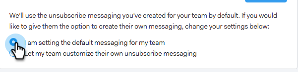

# Bericht voor opzeggen van koppeling aanpassen {#customize-unsubscribe-link-message}

Wij hebben teams altijd toegestaan om hun unsubscribe verbindingsoverseinen aan te passen, maar nu kunnen beheerders het unsubscribe verbindingsoverseinen voor hun volledig team plaatsen om verenigbaar overseinen te verzekeren.

>[!NOTE]
>
>U kunt een derdeunsubscribe-koppeling met [!DNL Sales Connect] niet gebruiken omdat deze informatie niet opnieuw in onze database wordt vastgelegd.

## Overseinen aanpassen voor uzelf {#customize-messaging-for-yourself}

1. Login aan de [ Webtoepassing ](https://toutapp.com/login), klik het tandwielpictogram op het hoogste recht en kies **[!UICONTROL Settings]**.

   

1. Selecteer onder [!UICONTROL My Account] de optie **[!UICONTROL Unsubscribes]** .

   

1. Schrijf uw aangepast bericht in het tekstvak uit.

   

1. Markeer de tekst waarop u wilt klikken om naar de afmeldingspagina te gaan en klik vervolgens op het koppelingspictogram.

   

   >[!NOTE]
   >
   >Het maakt niet uit wat de URL is die aan hyperlinks wordt gekoppeld. Wanneer het e-mailbericht wordt verzonden, wordt die hyperlink geconverteerd naar onze afmeldingskoppeling.

1. Klik op **[!UICONTROL OK]**.

   

## Abonnementsberichten voor uw team instellen {#set-unsubscribe-messaging-for-your-team}

1. Login aan de [ Webtoepassing ](https://toutapp.com/login), klik het tandwielpictogram op het hoogste recht en kies **[!UICONTROL Settings]**.

   

1. Selecteer onder [!UICONTROL Admin Settings] de optie **[!UICONTROL Unsubscribes]** .

   

1. Pas uw overseinen aan en klik **[!UICONTROL Save]** wanneer gedaan.

   

1. Selecteer **[!UICONTROL I am setting the default messaging for my team]** als u het bericht op alle gebruikers wilt toepassen.

   
