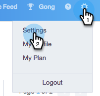

# Bericht voor opzeggen van koppeling aanpassen {#customize-unsubscribe-link-message}

Wij hebben teams altijd toegestaan om hun unsubscribe verbindingsoverseinen aan te passen, maar nu kunnen beheerders het unsubscribe verbindingsoverseinen voor hun volledig team plaatsen om verenigbaar overseinen te verzekeren.

>[!NOTE]
>
>U kunt een derdeunsubscribe-koppeling met Sales Connect niet gebruiken omdat deze gegevens niet opnieuw in onze database worden vastgelegd.

## Overseinen aanpassen voor uzelf {#customize-messaging-for-yourself}

1. Meld u aan bij de [webtoepassing](http://toutapp.com/login), klik op het tandwielpictogram rechtsboven en kies **Instellingen**.

   

1. Selecteer onder Mijn account de optie **Abonnementen** opzeggen.

   

1. Schrijf uw douaneoverseinen in het tekstvakje uit.

   

1. Markeer de tekst waarop u wilt klikken om naar de afmeldingspagina te gaan en klik vervolgens op het koppelingspictogram.

   

   >[!NOTE]
   >
   >Het maakt niet uit wat de URL is die aan hyperlinks wordt gekoppeld. Wanneer het e-mailbericht wordt verzonden, wordt die hyperlink geconverteerd naar onze afmeldingskoppeling.

1. Klik op **OK**.

   

## Abonnementsberichten voor uw team instellen {#set-unsubscribe-messaging-for-your-team}

1. Meld u aan bij de [webtoepassing](http://toutapp.com/login), klik op het tandwielpictogram rechtsboven en kies **Instellingen**.

   

1. Selecteer **Abonnementen** opheffen onder Beheer-instellingen.

   

1. Pas uw overseinen aan en klik **sparen** wanneer gedaan.

   

1. Selecteer **ik plaats het standaardoverseinen voor mijn team** om het overseinen te hebben op alle gebruikers van toepassing zijn.

   

