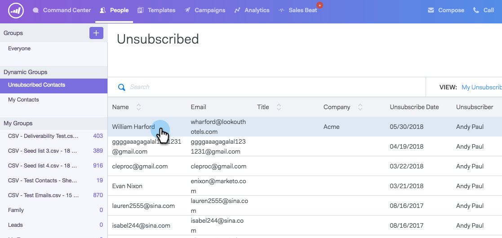

# Een [!UICONTROL Unsubscribe] opnieuw toewijzen {#resubscribing-an-unsubscribe}

Soms willen mensen ervoor kiezen om e-mails te ontvangen. Dit is hoe je afmeldingsberichten weer mailbaar kunt maken.

>[!NOTE]
>
>**Vereiste Bevoegdheden Admin**

>[!CAUTION]
>
>Voordat u iemand opnieuw abonneert, moet u kunnen aantonen dat de vergunning voor het opnieuw inschrijven van deze personen is gedocumenteerd en in overeenstemming is met alle toepasselijke wetten.

>[!NOTE]
>
>Als u de synchronisatie van uw abonnement hebt uitgeschakeld, moet u het abonnement opzeggen uit ToutApp verwijderen en de optie Weigeren [!DNL Salesforce] uitschakelen om de persoonrecord niet opnieuw te synchroniseren.

1. Ga naar de [ Webtoepassing ](https://toutapp.com/login) en klik **[!UICONTROL People]**.

1. Selecteer de persoon om de weergave van de persoondetails te openen.

   

1. Klik op de drie stippen in de weergave met persoonlijke details en selecteer **[!UICONTROL Remove Unsubscribe]** .

   

1. Selecteer de reden waarom de persoon weer wordt ingeschakeld om e-mails te ontvangen en klik vervolgens op **[!UICONTROL Remove Unsubscribe]** .

   

>[!NOTE]
>
>Als u de synchronisatie voor afmelden hebt ingeschakeld, moet u ook de optie om te weigeren uitschakelen in de record in Salesforce. Als deze optie niet is ingeschakeld, wordt de abonnement van de persoon in [!DNL Sales Connect] iedere avond opnieuw opgezegd, omdat deze detecteert dat de persoon is uitgeschakeld in [!DNL Salesforce] . Als een van de records de optie Weigeren/afmelden heeft, markeert de synchronisatie de gekoppelde record als zodanig.
