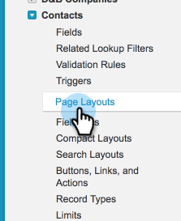

# Abonnementen synchroniseren met [!DNL Salesforce] {#syncing-unsubscribes-with-salesforce}

## Vereisten voor Unsubscribes to Sync aan [!DNL Salesforce] {#requirements-for-unsubscribes-to-sync-to-salesforce}

* Synchronisatie voor afmelden moet zijn ingeschakeld (voor nachtelijke synchronisatie)
* Het veld Uitschakelen moet zijn geïnstalleerd in [!DNL Salesforce]
* Persoonsrecords in [!DNL Sales Connect] moeten een [!DNL Salesforce] ID hebben

**duw Unsubscribes**

Wanneer een abonnement wordt opgehaald in [!DNL Sales Connect] , wordt dit in realtime naar [!DNL Salesforce] verplaatst en worden de velden voor Weigeren bijgewerkt waarmee u hebt geselecteerd voor synchronisatie. Als u de synchronisatie van [!DNL Salesforce] hebt uitgeschakeld, wordt de e-mailmelding weer verzonden naar de e-mailoptie Weigeren.

**Unsubscribe Synchronisatie**

Wanneer u de synchronisatie voor afmelden hebt ingeschakeld (stap 3 hieronder), schakelt u de nachtelijke synchronisatie in. De synchronisatie vindt eenmaal per dag plaats rond 08.00 uur PST. :00 Alle afmeldingsgegevens in Marketo Sales worden bidirectioneel gesynchroniseerd met het veld Opt Out in Salesforce.

## Synchronisatie voor afmelden configureren naar [!DNL Salesforce] {#configure-unsubscribe-sync-to-salesforce}

Gebruikers kunnen beslissen of ze hun afmeldingsgegevens willen synchroniseren met het standaardveld Afmelden via e-mail dat Marketo ook kan synchroniseren met, of ze kunnen synchroniseren met het veld Afmelden bij Marketo zodat Afmelden bij verkoop en Afmelden bij marketing kunnen worden gedifferentieerd.

1. Ga naar de [&#x200B; Webtoepassing &#x200B;](https://toutapp.com/login), klik het tandwielpictogram en selecteer **[!UICONTROL Settings]**.

   

1. Onder [!UICONTROL Admin Settings] selecteert u **[!UICONTROL Unsubscribes]** .

   

1. Klik op **[!UICONTROL Syncing to Salesforce]** en schakel vervolgens de nachtelijke synchronisatie in.

   

1. Selecteer het veld waarmee u wilt synchroniseren.

   

   | Veld | Beschrijving |
   |---|---|
   | **[!UICONTROL Sync to Salesforce Opt Out field]** | Hiermee wordt het veld [!DNL Salesforce] Weigeren alleen bijgewerkt. Deze optie is standaard ingeschakeld. |
   | **[!UICONTROL Sync to Marketo Sales Opt Out field]** | Als u verkoop en Marketing wilt scheiden unsubscribes, verkies deze optie om extra [&#x200B; de Verkoop van Marketo uit gebied bij te werken.](#msoo) |

## Het veld Weigeren installeren in de paginalayout {#installing-the-opt-out-field-in-the-page-layout}

**E-mail verlaat**

E-mail Weigeren is een standaardveld in [!DNL Salesforce] dat u kunt installeren vanuit [!DNL Salesforce] . U moet een [!DNL Salesforce] Admin zijn om het te installeren.

1. Ga naar [&#x200B; Salesforce.com &#x200B;](https://salesforce.com) en teken binnen.

   

1. Klik op uw gebruikersnaam en selecteer **[!UICONTROL Setup]** .

   

1. Zoek in het vak Snel zoeken naar Contactpersoon of Lead. In dit scenario installeren wij het gebied aan de de paginalay-out van het Contact, maar u zult voor beide persoonverslagen willen installeren.

   

1. Selecteer **[!UICONTROL Page Layouts]**.

   

1. Selecteer **[!UICONTROL Edit]** naast de pagina-indeling waaraan u het veld wilt toevoegen.

   

1. Selecteer **[!UICONTROL Fields]**.

   

1. Sleep [!UICONTROL Email Opt Out] naar de pagina-indeling.

   

1. Klik op **[!UICONTROL Save]**.

   

## Marketo-verkoop niet beschikbaar {#marketo-sales-opt-out}

Het veld Marketo Sales Opt Out is een aangepast veld dat beschikbaar is voor gebruikers die Marketo [!DNL Sales Connect] Customizations hebben geïnstalleerd.

Zodra u de Marketo [!DNL Sales Connect] Customizations in [!DNL Salesforce] hebt geïnstalleerd, ziet u het veld Marketo Sales Opt Out dat voor u beschikbaar is.
