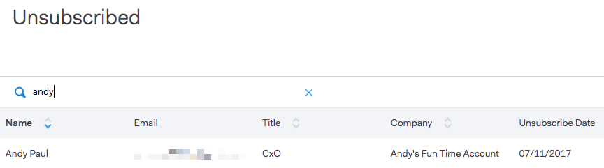

# Groep afmelden {#unsubscribe-group}

Alle geabonneerde personen op één locatie bekijken en beheren.

Gebruik de zoekbalk om geabonneerde personen op te zoeken.

Als u een beheerder bent, kunt u naar de groep gaan unsubscribe om door [!UICONTROL Account Unsubscribes] te filtreren en alle unsubscribes te zien die in uw personengegevensbestand zijn verzameld.

