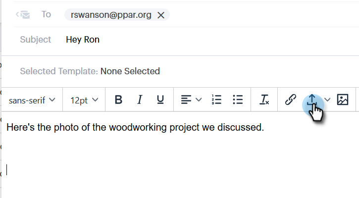

# Een bijlage of traceerbare inhoud toevoegen aan uw e-mail {#add-an-attachment-or-trackable-content-to-your-email}

Wanneer u een e-mailbericht verzendt via Sales Connect, kunt u een bestand toevoegen als bijlage of een bestand downloaden (en trackable) koppeling maken.

>[!NOTE]
>
>Gewoonlijk zijn bestanden van meer dan 20 MB te groot om te worden geleverd. De grootte van een bijlage die u via e-mail kunt verzenden, is afhankelijk van het verzendkanaal voor de e-mail dat u gebruikt.

## Een bijlage toevoegen {#add-an-attachment}

1. Maak uw e-mailconcept (er zijn meerdere manieren om dit te doen, in dit voorbeeld kiezen we **Samenstellen** in de koptekst).

   

1. Vul het veld Aan en voer een onderwerp in.

   

1. Klik op het bevestigingspictogram.

   

1. Selecteer het bestand dat u wilt bijvoegen en klik op **Invoegen**.

   

   >[!NOTE]
   >
   >Als u een bestand moet uploaden, klikt u op de knop **Inhoud uploaden** in de rechterbovenhoek van het venster.

   

De bijlage wordt onder aan het e-mailbericht weergegeven.

## Overtrekbare inhoud toevoegen {#add-trackable-content}

1. Maak uw e-mailconcept (er zijn meerdere manieren om dit te doen, in dit voorbeeld kiezen we het venster Samenstellen).

   

1. Vul het veld Aan en voer een onderwerp in.

   

1. Klik op de plaats in de e-mail waarvan u de traceerbare inhoud wilt weergeven en klik op het bevestigingspictogram.

   

1. Selecteer de inhoud die u wilt toevoegen, klik op de knop **Inhoud wordt bijgehouden** schuifregelaar en klik op **Invoegen**.

   

   >[!NOTE]
   >
   >Als u een bestand moet uploaden, klikt u op de knop **Inhoud uploaden** in de rechterbovenhoek van het venster.

   De inhoud wordt als een koppeling in uw e-mail weergegeven. De ontvanger kan op de koppeling klikken om de inhoud te downloaden.

   

   >[!NOTE]
   >
   >Gebruikers worden op de hoogte gesteld in Live feed wanneer mensen hun bijgehouden inhoud bekijken. Gebruikers kunnen ook de inhoud zien die het best wordt uitgevoerd in de inhoudsectie van de pagina Analytics.
