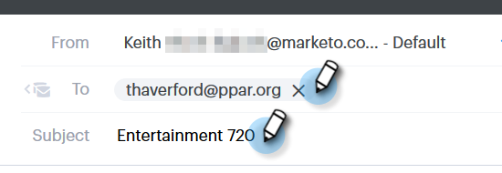
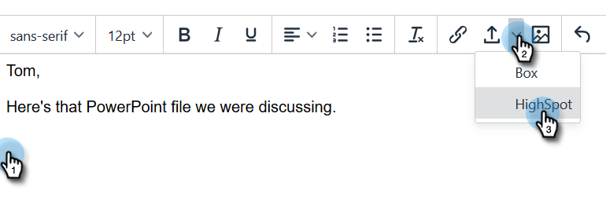

# [!DNL Highspot] Inhoud toevoegen aan uw e-mail {#adding-highspot-content-to-your-email}

Als u een [!DNL Highspot] -klant bent, kunt u eenvoudig [!DNL Highspot] -inhoud invoegen in uw [!DNL Sales Connect] -e-mails.

1. Maak uw e-mailconcept (hiervoor zijn meerdere manieren, in dit voorbeeld kiezen we **[!UICONTROL Compose]** in de koptekst).

   

1. Vul het veld [!UICONTROL To] en voer een [!UICONTROL Subject] in.

   

1. Klik op de plaats in de e-mail waar u de [!DNL Highspot] -inhoud wilt invoegen. Klik op de vervolgkeuzelijst met pijlen (naast het pictogram voor bijlagen) en selecteer **[!UICONTROL Highspot]** .

   

1. Meld u aan bij uw [!DNL Highspot] -account.

   

1. Selecteer de gewenste inhoud en klik op **[!UICONTROL Add Content]** .

   

   >[!NOTE]
   >
   >Als u de inhoud die u wilt weergeven niet ziet, gebruikt u de zoekbalk bovenaan.

   

De inhoud wordt als een koppeling in uw e-mail weergegeven. De ontvanger kan op de koppeling klikken om de inhoud weer te geven of te downloaden.
