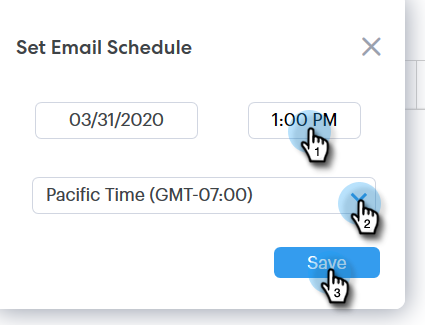

# Een e-mail plannen {#scheduling-an-email}

Volg deze eenvoudige stappen om een e-mail te plannen.

>[!NOTE]
>
>Ga naar de pagina Instellingen om de standaardtijdzone bij te werken.

1. Maak uw e-mailconcept (hiervoor zijn meerdere manieren, in dit voorbeeld kiezen we **[!UICONTROL Compose]** in de koptekst).

   

1. Wanneer u klaar bent met het samenstellen van uw e-mail, klikt u op **[!UICONTROL Schedule]** rechtsonder

   

1. Klik op de datum waarop u de datumkiezer wilt openen en selecteer een datum.

   

1. Voer de tijd in waarop het e-mailbericht moet verschijnen. Selecteer de gewenste tijdzone en klik op **[!UICONTROL Save]** . Sluit de planner wanneer gedaan.

   

1. Nu de geplande datum/tijd is geselecteerd, klikt u op **[!UICONTROL Send]** om het e-mailbericht te plannen.

   

   >[!NOTE]
   >
   >Gepland e-mailbericht kan worden weergegeven/bewerkt in de sectie voor geplande mappen van het Opdrachtcentrum.

   >[!MORELIKETHIS]
   >
   >[ Overzicht van het Centrum van het Bevel ](/help/marketo/product-docs/marketo-sales-connect/email/command-center/command-center-overview.md)
