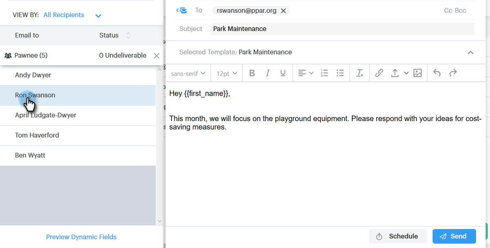

# E-mailberichten verzenden via e-mail voor groep {#sending-emails-via-group-email}

Hieronder wordt beschreven hoe u e-mailberichten verzendt/bewerkt met de optie Groep-e-mail.

## Groeps-e-mailberichten verzenden {#sending-a-group-email}

1. Klik op de tab **[!UICONTROL People]** .

   

1. Selecteer de groep die u per e-mail wilt verzenden.

   

1. Klik op [!UICONTROL Group Actions] en selecteer **[!UICONTROL Email Group]** .

   

1. Vul uw e-mail in (of selecteer een sjabloon) en verzend (of plant) het.

   

## Een groepse-e-mail bewerken {#editing-a-group-email}

1. Creeer een groep e-mail gebruikend [ Stappen 1-3 hierboven ](#sending-a-group-email).

1. Kies een sjabloon of vul uw e-mail in.

   

1. Als e-mail gereed is, kunt u nu een voorbeeld van elke e-mail in de lijst bekijken om te zien of de dynamische velden correct worden ingevuld.

   

1. Selecteer de gewenste ontvanger.

   

1. Klik op **[!UICONTROL Preview Dynamic Fields]** en bekijk de voorvertoning aan de rechterkant.

   

   >[!NOTE]
   >
   >U kunt bulkbewerkingen uitvoeren op de e-mail/sjabloon wanneer u een groepse-mail verstuurt, maar u kunt geen unieke bewerkingen uitvoeren voor specifieke ontvangers in de lijst.

>[!MORELIKETHIS]
>
>* [ Bulk die Opties ](/help/marketo/product-docs/marketo-sales-connect/email/using-the-compose-window/bulk-sending-options.md) verzendt
>* [ Gebruikend een Malplaatje in Samenstellen Venster ](/help/marketo/product-docs/marketo-sales-connect/email/using-the-compose-window/using-a-template-in-the-compose-window.md)
