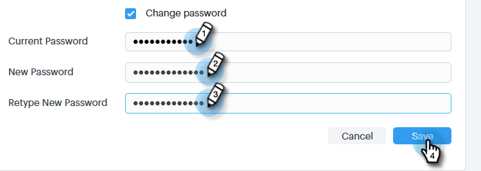

# Uw wachtwoord voor verkoop wijzigen {#change-your-sales-connect-password}

Wilt u uw wachtwoord wijzigen? Zo gaat het.

## Wijzig uw wachtwoord bij aanmelding {#change-your-password-while-signed-in}

1. Klik op het tandwielpictogram en selecteer **Instellingen**.

   

1. De pagina Mijn profiel wordt standaard geopend. Selecteer onder Accountdetails het selectievakje **Wachtwoord wijzigen**.

   

1. Voer uw huidige wachtwoord in. Voer vervolgens de nieuwe in en typ deze opnieuw om er zeker van te zijn dat ze overeenkomen. Klik **Opslaan** wanneer gereed.

   

>[!NOTE]
>
>Wachtwoorden moeten:
>
>* Bevat ten minste negen tekens
>* Gebruik een combinatie van hoofdletters en kleine letters
>* Een getal opnemen
>* Een speciaal teken gebruiken

## Wijzig uw wachtwoord bij het uitloggen {#change-your-password-while-signed-out}

1. Navigeer naar de [Login van de Verkoop Connect](https://toutapp.com/login) pagina en klik **Wachtwoord vergeten**.

   

1. Voer het e-mailadres in dat aan de account is gekoppeld en klik op **E-mail opnieuw instellen verzenden**.

   

1. We zullen een e-mail verzenden om te controleren of de accounteigenaar het wachtwoord wil wijzigen. Klik **Wachtwoord opnieuw instellen**.

   

   >[!NOTE]
   >
   >Controleer ook uw map Spam, aangezien deze e-mail daar soms kan eindigen.

1. Voer uw nieuwe wachtwoord in en bevestig dit. Klik **Wachtwoord instellen** wanneer gereed.

   
